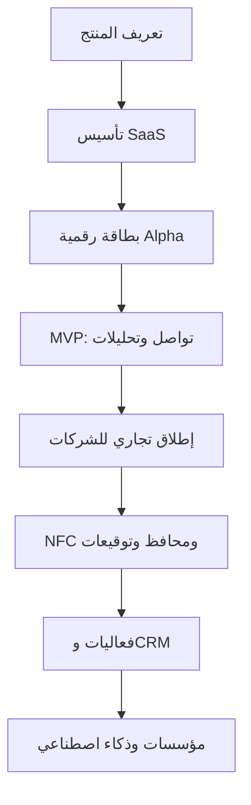

# خارطة طريق تطوير منصة البطاقات التعريفية الرقمية بنظام SaaS

**اسم الوثيقة:** خارطة مراحل تطوير منصة Digital Business Card SaaS  
**الإصدار:** 1.0  
**التاريخ:** 12 أغسطس 2026  
**الحالة:** مقترح للتخطيط والتنفيذ

---

## 1. الملخص التنفيذي

تهدف هذه الوثيقة إلى ترتيب تطوير منصة سحابية للبطاقات التعريفية الرقمية على مراحل واضحة وقابلة للقياس. تبدأ المنصة بمنتج أولي يخدم الأفراد ويتيح إنشاء البطاقة ومشاركتها وجمع بيانات التواصل، ثم تتوسع إلى إدارة المؤسسات والاشتراكات، وبعدها تضيف أدوات الحضور المهني والمبيعات والفعاليات والتكاملات، وصولاً إلى متطلبات المؤسسات الكبيرة والذكاء الاصطناعي.

التوجه المقترح للمنتج هو:

> **منصة لإدارة الهوية المهنية والتواصل وجمع العملاء المحتملين، وليست مجرد بديل إلكتروني للبطاقة الورقية.**

تعتمد الأولويات على تقديم قيمة قابلة للاستخدام والاختبار مبكراً، مع تأسيس تعددية المؤسسات، وعزل البيانات، واللغة العربية، والخصوصية منذ بداية التطوير.

---

## 2. أهداف المنتج

1. تمكين الأفراد من إنشاء بطاقة مهنية رقمية ومشاركتها بسهولة.
2. تمكين الشركات من إدارة بطاقات موظفيها وهويتها المؤسسية من لوحة مركزية.
3. تحويل مشاركة البطاقة إلى قناة قابلة للقياس لجمع العملاء المحتملين ومتابعتهم.
4. دعم السوق العُماني والخليجي من خلال العربية وRTL وWhatsApp والفوترة المحلية.
5. توفير منصة آمنة ومتوافقة مع متطلبات حماية البيانات الشخصية.
6. بناء أساس تقني يسمح بالتوسع إلى المؤسسات الكبيرة والتكاملات والذكاء الاصطناعي.

---

## 3. مبادئ ترتيب المراحل

- تطوير تجربة Web App/PWA متجاوبة قبل الاستثمار في تطبيقات iOS وAndroid أصلية.
- عدم اشتراط تنزيل تطبيق لفتح البطاقة أو حفظ بياناتها.
- بناء تعددية المؤسسات وعزل بيانات المستأجرين من البداية.
- تضمين العربية والإنجليزية وRTL داخل التصميم الأساسي، وليس كتطوير لاحق.
- إطلاق الوظائف الأساسية واختبار استخدامها قبل بناء التكاملات المعقدة.
- تأجيل ميزات الذكاء الاصطناعي حتى تتوفر بيانات استخدام وحالات عمل واضحة.
- تطبيق الخصوصية والأمان بالتصميم Privacy and Security by Design.
- استخدام بوابات خروج واضحة لكل مرحلة قبل الانتقال إلى المرحلة التالية.

---

## 4. النظرة العامة على خارطة الطريق

| المرحلة   | الهدف                          | المدة التقديرية | المخرج الرئيسي                 |
| --------- | ------------------------------ | --------------: | ------------------------------ |
| المرحلة 0 | تعريف المنتج وتجربة المستخدم   |      2–3 أسابيع | وثيقة منتج ونموذج أولي معتمدان |
| المرحلة 1 | تأسيس منصة SaaS                |      3–4 أسابيع | أساس تقني وأمني متعدد المؤسسات |
| المرحلة 2 | البطاقة الرقمية الأساسية       |      4–5 أسابيع | إصدار Alpha                    |
| المرحلة 3 | التواصل والتحليلات             |      3–4 أسابيع | MVP تجريبي                     |
| المرحلة 4 | الشركات والاشتراكات            |      4–6 أسابيع | إطلاق تجاري مدفوع              |
| المرحلة 5 | الحضور المهني المتكامل         |      4–6 أسابيع | إصدار نمو وتوسع                |
| المرحلة 6 | المبيعات والفعاليات والتكاملات |      5–8 أسابيع | إصدار أعمال متقدم              |
| المرحلة 7 | المؤسسات والذكاء الاصطناعي     |          مستمرة | إصدار Enterprise               |

> المدد تقديرية لفريق صغير متفرغ، ويمكن تنفيذ بعض المسارات بالتوازي وفق حجم الفريق.

---

## 5. المرحلة صفر: تعريف المنتج وتجربة المستخدم

### 5.1 الهدف

تثبيت نطاق المنتج، وتحديد المستخدمين وحالات الاستخدام وتجربة الاستخدام قبل بدء البرمجة.

### 5.2 المستخدمون المستهدفون

- الأفراد والمهنيون.
- رواد الأعمال وأصحاب المشاريع.
- الشركات الصغيرة والمتوسطة.
- المؤسسات الكبيرة والجهات الحكومية.
- فرق التسويق والمبيعات.
- منظمو ومشاركو المعارض والمؤتمرات.

### 5.3 الأعمال المطلوبة

- إجراء مقابلات قصيرة مع مستخدمين محتملين.
- تحديد المشكلات ذات الأولوية لكل فئة.
- تحديد القيمة المقترحة للمنتج Value Proposition.
- تحديد الباقات والأسعار المبدئية.
- رسم رحلات المستخدم الأساسية:
  - التسجيل.
  - إنشاء البطاقة.
  - تخصيص التصميم.
  - نشر البطاقة.
  - مشاركة البطاقة.
  - استقبال بيانات جهة اتصال.
  - مراجعة التحليلات.
- تصميم Wireframes للشاشات الأساسية.
- إعداد نموذج أولي قابل للنقر.
- اختبار النموذج مع عينة من المستخدمين.
- إعداد وثيقة متطلبات المنتج PRD.
- تحويل المتطلبات إلى Epics وUser Stories وAcceptance Criteria.
- تحديد مؤشرات نجاح المنتج.

### 5.4 المخرجات

- وثيقة متطلبات منتج معتمدة.
- خريطة رحلة المستخدم.
- نموذج أولي قابل للنقر.
- قائمة ميزات مرتبة حسب الأولوية.
- نموذج بيانات أولي.
- Product Backlog للإصدار الأول.

### 5.5 بوابة الخروج

لا تبدأ مرحلة التطوير قبل اعتماد تجربة إنشاء البطاقة ونشرها ومشاركتها وتبادل بيانات التواصل.

---

## 6. المرحلة الأولى: تأسيس منصة SaaS

### 6.1 الهدف

إنشاء الأساس التقني والأمني الذي ستبنى عليه جميع وظائف المنصة اللاحقة.

### 6.2 إدارة الحسابات

- إنشاء حساب بالبريد الإلكتروني.
- التحقق من البريد الإلكتروني.
- تسجيل الدخول والخروج.
- استعادة كلمة المرور.
- إدارة الملف الشخصي.
- إدارة الجلسات الأساسية.
- حذف الحساب.
- تنزيل نسخة من بيانات المستخدم.

### 6.3 البنية متعددة المؤسسات Multi-Tenant

- إنشاء كيان مستخدم User.
- إنشاء كيان مؤسسة Organization/Tenant.
- فصل بيانات كل مؤسسة منطقياً وأمنياً.
- السماح بانضمام المستخدم إلى مؤسسة.
- تحديد الأدوار الأولية:
  - مالك المؤسسة.
  - مسؤول.
  - عضو.
- وضع أساس للصلاحيات Role-Based Access Control.

### 6.4 الأساس التقني والتشغيلي

- إعداد بيئات Development وStaging وProduction.
- إدارة الإعدادات والأسرار بصورة آمنة.
- تخزين الصور والشعارات والملفات.
- خدمة إرسال البريد الإلكتروني والإشعارات.
- سجل عمليات أساسي Audit Trail.
- نسخ احتياطي واستعادة.
- مراقبة الأخطاء والأداء.
- Health Checks للخدمات.
- Feature Flags للتحكم في إطلاق الوظائف.
- لوحة Super Admin أولية.

### 6.5 اللغة والتجربة

- العربية والإنجليزية.
- دعم كامل لاتجاه RTL.
- تصميم متجاوب Mobile-First.
- إعدادات اللغة والمنطقة الزمنية.
- أساس لمتطلبات الوصول الرقمي Accessibility.

### 6.6 الخصوصية والأمان

- سياسة الخصوصية وشروط الاستخدام.
- تسجيل موافقات المستخدم.
- موافقة منفصلة للتسويق.
- آلية طلب تصحيح البيانات أو حذفها.
- سجل لأنشطة معالجة البيانات.
- تشفير الاتصال باستخدام HTTPS/TLS.
- تشفير الحقول أو الملفات الحساسة عند الحاجة.
- حماية من محاولات الدخول المتكررة وإساءة الاستخدام.

ينبغي أن تراعي المنصة قانون حماية البيانات الشخصية العُماني ولائحته التنفيذية، بما يشمل الموافقة وحقوق صاحب البيانات وسجل المعالجة وضوابط التسويق والإبلاغ عن الاختراقات عند انطباق المتطلبات. راجع [إرشادات حماية البيانات الشخصية – وزارة النقل والاتصالات وتقنية المعلومات](https://mtcit.gov.om/sectors/governance/personal).

### 6.7 بوابة الخروج

- نجاح التسجيل والدخول والاستعادة والحذف.
- إثبات عدم قدرة أي مؤسسة على الوصول إلى بيانات مؤسسة أخرى.
- عمل الواجهات الأساسية بالعربية والإنجليزية.
- توفر النسخ الاحتياطي ومراقبة الأخطاء.
- اجتياز مراجعة أمنية أولية.

---

## 7. المرحلة الثانية: البطاقة الرقمية الأساسية

### 7.1 الهدف

تقديم أول قيمة مباشرة للمستخدم: إنشاء بطاقة رقمية احترافية ونشرها ومشاركتها.

### 7.2 بيانات البطاقة

- الاسم بالعربية والإنجليزية.
- المسمى الوظيفي.
- المؤسسة والقسم.
- الصورة الشخصية والشعار.
- نبذة مهنية.
- الهاتف والبريد الإلكتروني.
- WhatsApp.
- الموقع الإلكتروني.
- العنوان والموقع الجغرافي.
- روابط شبكات التواصل الاجتماعي.
- رابط حجز موعد.
- أزرار إجراء مخصصة Call to Action.

### 7.3 التصميم

- توفير 3–5 قوالب أولية.
- تخصيص الألوان والخطوط.
- إضافة صورة غلاف وشعار.
- ترتيب الحقول وإخفاؤها.
- معاينة على الهاتف والحاسب.
- دعم الوضع الداكن والفاتح.

### 7.4 دورة حياة البطاقة

- حفظ كمسودة.
- معاينة.
- نشر وإلغاء نشر.
- رابط شخصي وفريد.
- تحديث البطاقة دون تغيير الرابط.
- بطاقة واحدة في الباقة المجانية.
- دعم عدة بطاقات في الباقات المدفوعة لاحقاً.
- عرض عربي أو إنجليزي مع اختيار اللغة.

### 7.5 المشاركة

- QR Code ديناميكي.
- رابط مباشر.
- مشاركة عبر WhatsApp.
- مشاركة عبر البريد الإلكتروني.
- نسخ الرابط.
- حفظ البيانات بصيغة vCard.
- الاتصال وفتح البريد والخرائط مباشرة.
- فتح البطاقة دون تسجيل أو تنزيل تطبيق.

عدم اشتراط تطبيق لدى المستلم من الخصائص الأساسية في حلول السوق مثل [Blinq](https://blinq.me/solutions/digital-business-card) و[HiHello](https://www.hihello.com/features/share-digital-business-cards).

### 7.6 نقطة الإطلاق

إصدار **Alpha** داخلي أو لمجموعة محدودة من المستخدمين.

### 7.7 بوابة الخروج

- يستطيع المستخدم إنشاء ونشر بطاقة خلال أقل من خمس دقائق.
- يعمل QR وvCard على iOS وAndroid.
- تظهر البطاقة بصورة صحيحة على أحجام الشاشات المختلفة.
- يمكن تحديث البطاقة دون إعادة إصدار QR.
- لا تتطلب مشاهدة البطاقة حساباً أو تطبيقاً.

---

## 8. المرحلة الثالثة: تبادل التواصل والتحليلات — MVP

### 8.1 الهدف

تحويل البطاقة من صفحة تعريفية إلى أداة تواصل قابلة للقياس.

### 8.2 تبادل معلومات الاتصال

- نموذج «شارك بياناتك معي».
- الاسم والهاتف والبريد والمؤسسة.
- موافقة واضحة على حفظ البيانات.
- حقول اختيارية قابلة للتخصيص.
- رسالة تأكيد بعد الإرسال.
- رسالة شكر آلية.
- إشعار لصاحب البطاقة عند وصول جهة اتصال جديدة.

### 8.3 إدارة جهات الاتصال

- قائمة جهات الاتصال.
- البحث والتصفية.
- الملاحظات.
- التصنيفات Tags.
- مصدر جهة الاتصال.
- حالة المتابعة.
- تذكير بالمتابعة.
- تصدير CSV.
- اكتشاف التكرار الأساسي.

### 8.4 التحليلات الأولية

- عدد مشاهدات البطاقة.
- عدد الزوار الفريدين.
- النقرات على الهاتف والبريد وWhatsApp والروابط.
- عدد مرات تنزيل vCard.
- عدد نماذج التواصل المكتملة.
- معدل التحويل من زيارة إلى جهة اتصال.
- التصفية حسب البطاقة والفترة الزمنية.

### 8.5 لوحة المستخدم

- ملخص أداء البطاقة.
- أحدث جهات الاتصال.
- أكثر الروابط استخداماً.
- النشاط خلال آخر 7 و30 يوماً.

### 8.6 نقطة الإطلاق

إصدار **MVP تجريبي** لمجموعة مختارة من الأفراد وعدد محدود من المؤسسات.

### 8.7 مؤشرات النجاح

- نسبة المستخدمين الذين ينشرون بطاقة بعد التسجيل.
- متوسط الوقت اللازم لإنشاء البطاقة.
- عدد المشاركات لكل بطاقة.
- معدل التحويل إلى جهة اتصال.
- عدد المستخدمين النشطين خلال 7 و30 يوماً.
- معدل عودة المستخدمين إلى لوحة التحكم.

### 8.8 بوابة الخروج

- استخدام MVP فعلياً من قبل مستخدمين خارجيين.
- جمع ملاحظات قابلة للتنفيذ.
- استقرار وظائف المشاركة والتواصل والتحليلات.
- عدم وجود مشكلات أمنية أو فقدان للبيانات من الدرجة العالية.

---

## 9. المرحلة الرابعة: الشركات والاشتراكات

### 9.1 الهدف

تحويل المنتج إلى منصة تجارية مدفوعة قابلة للاستخدام من الشركات والفرق.

### 9.2 إدارة المؤسسات والموظفين

- إنشاء مؤسسة ومساحة عمل.
- دعوة الموظفين.
- تقسيم المؤسسة إلى إدارات وفروع.
- دليل موظفين قابل للبحث.
- أدوار وصلاحيات أكثر دقة.
- مسؤول فرع أو إدارة.
- استيراد الموظفين من Excel أو CSV.
- إنشاء البطاقات جماعياً.
- تعطيل بطاقة الموظف عند مغادرته.
- نقل ملكية البيانات التجارية حسب سياسة المؤسسة.

### 9.3 الهوية المؤسسية

- قوالب مركزية موحدة.
- شعار وألوان وخطوط المؤسسة.
- قفل الحقول الأساسية.
- تحديد الحقول التي يستطيع الموظف تعديلها.
- سير موافقة على تعديلات البطاقة.
- قوالب مختلفة حسب الإدارة أو الفرع.
- نطاق مخصص.
- إزالة شعار المنصة في الباقات المدفوعة.

### 9.4 الاشتراكات والفوترة

- باقة مجانية.
- باقة احترافية للأفراد.
- باقة فرق وشركات.
- باقة مؤسسات.
- اشتراك شهري وسنوي.
- فترة تجريبية.
- التسعير حسب البطاقات أو المستخدمين النشطين.
- الدفع الإلكتروني.
- الفواتير وضريبة القيمة المضافة.
- الترقية وخفض الباقة.
- الإلغاء والتجديد.
- أكواد الخصم.
- تطبيق حدود وميزات كل باقة Feature Entitlements.

### 9.5 إدارة المنصة

- إدارة المؤسسات والمستخدمين.
- إدارة الخطط والأسعار.
- إدارة الاشتراكات والمدفوعات.
- إدارة القوالب العامة.
- إدارة الدعم والبلاغات.
- تقارير الإيرادات والاستخدام.
- تعليق الحسابات المخالفة وفق سياسة واضحة.

إدارة البطاقات والقوالب والحقول المقفلة مركزياً من الوظائف المهمة للفرق في [Blinq Business](https://blinq.me/pricing)، كما تقدم HiHello دليلاً مؤسسياً مركزياً للبطاقات. راجع [HiHello Employee Directory](https://www.hihello.com/features/corporate-directory).

### 9.6 نقطة الإطلاق

أول **إصدار تجاري مدفوع**.

### 9.7 بوابة الخروج

- قدرة مؤسسة على إضافة وإدارة 50–100 موظف دون تدخل تقني مباشر.
- نجاح دورة الدفع والتجديد والإلغاء.
- تطبيق حدود الباقات بصورة صحيحة.
- قدرة المسؤول على توحيد هوية البطاقات.
- توفر دعم واستجابة للحالات التشغيلية الأساسية.

---

## 10. المرحلة الخامسة: الحضور المهني المتكامل

### 10.1 الهدف

توسيع البطاقة لتظهر في نقاط التواصل المهنية المختلفة.

### 10.2 NFC والمحافظ الرقمية

- ربط البطاقة بأي NFC Tag متوافق.
- إدارة الرابط المرتبط بـNFC.
- إلغاء أو إعادة تعيين بطاقة NFC المفقودة.
- Apple Wallet.
- Google Wallet.
- QR مخصص يحمل الشعار والألوان.
- دعم مشاركة أساسية دون اتصال عند الإمكان.

### 10.3 البريد والاجتماعات

- مولد توقيع بريد إلكتروني.
- قوالب توقيع متعددة.
- إضافة QR داخل التوقيع.
- دعم Gmail وOutlook وApple Mail.
- خلفيات Zoom وMicrosoft Teams وGoogle Meet.
- إنشاء الخلفية من بيانات البطاقة.
- تحديث البطاقة والخلفية من المصدر نفسه.

### 10.4 الحملات

- QR مستقل لكل حملة.
- UTM Parameters.
- تحديد مصدر الزيارة.
- تاريخ بداية ونهاية الحملة.
- تقارير أداء الحملة.

### 10.5 ترتيب تنفيذ التوقيعات

1. توليد توقيع يستطيع المستخدم نسخه يدوياً.
2. توفير قوالب مؤسسية مركزية.
3. النشر التلقائي على Google Workspace وMicrosoft 365.
4. إضافة حملات Banner قابلة للجدولة والقياس.

تقدم HiHello إدارة مركزية للتوقيعات وحملات قابلة للقياس، ما يجعلها وظيفة مهمة عند المنافسة في السوق المؤسسي. راجع [HiHello Email Signature Manager](https://www.hihello.com/features/email-signature-manager).

### 10.6 بوابة الخروج

- نجاح إضافة البطاقة إلى Apple Wallet وGoogle Wallet.
- نجاح قراءة NFC على مجموعة الأجهزة المدعومة.
- عمل التوقيع على أشهر عملاء البريد.
- ظهور الخلفيات بصورة صحيحة في منصات الاجتماعات.

---

## 11. المرحلة السادسة: المبيعات والفعاليات والتكاملات

### 11.1 الهدف

دعم فرق المبيعات والمعارض وربط بيانات التواصل بأنظمة العمل المؤسسية.

### 11.2 مسح البطاقات والشارات

- تصوير بطاقة الأعمال الورقية.
- OCR عربي وإنجليزي.
- مراجعة البيانات المستخرجة قبل الحفظ.
- مسح شارات المؤتمرات والمعارض.
- قراءة QR من منصات أخرى.
- ربط جهة الاتصال بالموظف والفعالية والحملة.

### 11.3 إدارة الفعاليات

- إنشاء فعالية.
- إنشاء بطاقات مخصصة للفعالية.
- تصنيف جهات الاتصال تلقائياً.
- حقول تأهيل العميل Lead Qualifiers.
- لوحة أداء مباشرة.
- مقارنة أداء أعضاء الفريق.
- تقارير ما بعد الفعالية.
- قياس عدد العملاء المحتملين ومعدل التحويل والعائد.

### 11.4 ترتيب التكاملات

1. Webhooks وREST API.
2. Zapier أو Make.
3. Google Contacts وMicrosoft Contacts.
4. HubSpot وZoho CRM.
5. Salesforce.
6. Microsoft Dynamics 365.
7. أنظمة الموارد البشرية ودليل الموظفين.

### 11.5 مزامنة CRM

- تحديد الحقول التي ستتم مزامنتها.
- تحديد مالك العميل المحتمل.
- منع إنشاء السجلات المكررة.
- سجل بحالة المزامنة.
- إعادة محاولة العمليات الفاشلة.
- مزامنة باتجاه واحد أولاً.
- إضافة المزامنة ثنائية الاتجاه عند ثبوت الحاجة.

توفر HiHello جمع العملاء من البطاقات وشارات المعارض وربطهم بالفعاليات وCRM مع تقارير الفرق، وهو مرجع مناسب لنطاق هذه المرحلة. راجع [HiHello Event Lead Retrieval](https://www.hihello.com/features/event-lead-retrieval).

### 11.6 بوابة الخروج

- تحقيق دقة مقبولة في OCR العربي والإنجليزي.
- معالجة فشل المزامنة دون فقدان البيانات.
- قدرة الفريق على إنشاء فعالية ومتابعة نتائجها دون دعم تقني.
- وجود سجل واضح لكل عملية تصدير أو مزامنة.

---

## 12. المرحلة السابعة: المؤسسات والذكاء الاصطناعي

### 12.1 الهدف

تلبية متطلبات المؤسسات الكبيرة وإضافة الأتمتة والذكاء بعد استقرار الاستخدام الأساسي.

### 12.2 متطلبات المؤسسات

- Single Sign-On عبر SAML وOIDC.
- SCIM لإضافة الموظفين وحذفهم تلقائياً.
- Microsoft Entra ID وOkta.
- صلاحيات مخصصة ودقيقة.
- مسؤولو إدارات وفروع فرعيون.
- سجل تدقيق متقدم قابل للتصدير.
- سياسات الاحتفاظ والحذف.
- خيارات استضافة وموقع البيانات.
- White Label كامل.
- إدارة عدة علامات تجارية.
- اتفاقيات مستوى خدمة SLA.
- API Keys وحدود استخدام Rate Limits.
- تقارير أمن وامتثال.
- الاستعداد لشهادات ISO 27001 وSOC 2 حسب السوق المستهدف.

### 12.3 ميزات الذكاء الاصطناعي

- إنشاء نبذة مهنية.
- ترجمة المحتوى بين العربية والإنجليزية.
- اقتراح تحسينات لمحتوى البطاقة.
- استخراج بيانات أولية من السيرة الذاتية.
- اقتراح رسالة متابعة.
- تلخيص ملاحظات الاجتماع بعد الحصول على الموافقات المطلوبة.
- تصنيف العملاء المحتملين.
- اكتشاف المعلومات الناقصة أو غير المتسقة.
- إثراء جهات الاتصال ضمن ضوابط الخصوصية.
- الاستعلام عن أداء البطاقات والفرق باللغة الطبيعية.

تقدم Blinq بعض الوظائف المتقدمة مثل إثراء جهات الاتصال ومسح البطاقات والملاحظات الذكية ضمن خططها المتقدمة، ما يدعم تأجيل هذه القدرات إلى ما بعد ثبات الوظائف الأساسية. راجع [Blinq Plans and Features](https://blinq.me/pricing).

### 12.4 ضوابط استخدام الذكاء الاصطناعي

- إبلاغ المستخدم عند استخدام الذكاء الاصطناعي.
- الحصول على الموافقة عند تسجيل أو تلخيص المحادثات.
- إتاحة مراجعة وتعديل المخرجات قبل اعتمادها.
- عدم استخدام بيانات مؤسسة لتدريب نماذج تخدم مؤسسة أخرى.
- تسجيل مصدر البيانات والغرض من المعالجة.
- توفير خيار تعطيل وظائف الذكاء الاصطناعي للمؤسسة.

### 12.5 بوابة الخروج

- اجتياز متطلبات الأمان المؤسسية المتفق عليها.
- نجاح SSO وSCIM في بيئة تجريبية مع عميل مؤسسي.
- قياس جودة وفائدة كل ميزة ذكاء اصطناعي قبل تعميمها.
- توثيق سياسات البيانات والخصوصية والاحتفاظ.

---

## 13. نطاق MVP المعتمد

يتكون MVP من المراحل 0 إلى 3، ويشمل الحد الأدنى التالي:

1. التسجيل وإدارة الحساب.
2. بنية متعددة المؤسسات مع عزل البيانات.
3. العربية والإنجليزية وRTL.
4. إنشاء بطاقة رقمية وتعديلها ونشرها.
5. قوالب وتخصيص أساسي.
6. رابط شخصي وQR ديناميكي.
7. مشاركة عبر WhatsApp والبريد والرابط.
8. حفظ vCard.
9. نموذج تبادل معلومات الاتصال والموافقة.
10. إدارة جهات الاتصال والملاحظات والتصنيفات.
11. تحليلات المشاهدة والنقر والتحويل.
12. لوحة مستخدم مبسطة.
13. وظائف الخصوصية والحذف وتنزيل البيانات.
14. لوحة إدارة تشغيلية أساسية.

### تعريف نجاح MVP

يُعد MVP ناجحاً عندما يستطيع مستخدم خارجي أن:

- يسجل دون مساعدة.
- ينشئ بطاقة خلال أقل من خمس دقائق.
- ينشر ويشارك QR أو الرابط.
- يستقبل بيانات جهة اتصال بموافقتها.
- يراجع جهات الاتصال والتحليلات.
- يعود لاستخدام البطاقة ومتابعة النتائج بصورة متكررة.

---

## 14. الميزات المؤجلة من MVP

- تطبيقات iOS وAndroid أصلية.
- Apple Wallet وGoogle Wallet.
- إدارة NFC ومتجر البطاقات الفعلية.
- النشر المركزي للتوقيعات البريدية.
- SSO وSCIM.
- تكامل مباشر مع جميع أنظمة CRM.
- White Label الكامل.
- نظام فعاليات متكامل.
- مزامنة ثنائية الاتجاه مع الأنظمة الخارجية.
- تقارير ROI المعقدة.
- مساعد ملاحظات الاجتماعات بالذكاء الاصطناعي.
- إثراء جهات الاتصال المتقدم.
- عدد كبير من القوالب والتخصيصات النادرة.

---

## 15. مراحل الإطلاق

| الإصدار    | المراحل المشمولة | الجمهور                  | الهدف                               |
| ---------- | ---------------- | ------------------------ | ----------------------------------- |
| Alpha      | 0–2              | الفريق ومستخدمون محدودون | اختبار إنشاء البطاقة والمشاركة      |
| Pilot MVP  | 0–3              | أفراد وشركات تجريبية     | إثبات الاستخدام والتواصل والتحليلات |
| Commercial | 0–4              | الأفراد والشركات         | بدء الإيرادات والاشتراكات           |
| Growth     | حتى 5            | المستخدمون المحترفون     | توسيع نقاط الحضور والمشاركة         |
| Business   | حتى 6            | المبيعات والفعاليات      | جمع العملاء والتكامل مع الأنظمة     |
| Enterprise | حتى 7            | المؤسسات الكبيرة         | الأمان والهوية والأتمتة المتقدمة    |

---

## 16. مؤشرات الأداء حسب المرحلة

| المرحلة          | المؤشرات الأساسية                                                       |
| ---------------- | ----------------------------------------------------------------------- |
| البطاقة الأساسية | وقت إنشاء البطاقة، نسبة النشر، نجاح QR وvCard                           |
| MVP              | عدد المشاركات، معدل التحويل، المستخدمون النشطون، الاحتفاظ لمدة 30 يوماً |
| الإطلاق التجاري  | التحويل إلى باقة مدفوعة، الإيراد الشهري المتكرر، إلغاء الاشتراك         |
| الشركات          | عدد المقاعد النشطة، زمن تهيئة المؤسسة، استخدام القوالب المركزية         |
| الحضور المهني    | استخدام NFC والمحافظ والتوقيعات، أداء الحملات                           |
| الفعاليات وCRM   | العملاء لكل فعالية، دقة المسح، نجاح المزامنة، عائد الفعالية             |
| المؤسسات         | وقت تهيئة SSO/SCIM، الالتزام بـSLA، الحوادث الأمنية، رضا العملاء        |

---

## 17. المتطلبات غير الوظيفية المستمرة

يجب تطبيق هذه المتطلبات عبر جميع المراحل:

- الأمان وعزل بيانات المؤسسات.
- حماية الخصوصية وإدارة الموافقات.
- الأداء وسرعة فتح البطاقة العامة.
- التوفر والاعتمادية.
- النسخ الاحتياطي والاستعادة.
- مراقبة الأخطاء والسجلات.
- دعم العربية وRTL.
- قابلية الوصول الرقمي.
- قابلية التوسع الأفقي.
- الاختبارات الآلية.
- التوثيق التقني وتوثيق API.
- إدارة الإصدارات والترحيلات وقواعد البيانات.

---

## 18. التوصية التنفيذية

الأولوية الأولى هي الوصول إلى MVP قابل للتجربة خلال نحو **12–16 أسبوعاً**، ثم استخدام بيانات التجربة لتحديد ما إذا كانت الأولوية التالية هي الشركات والاشتراكات أو أدوات الفعاليات والمبيعات.

يُوصى بعدم البدء بعدد كبير من القوالب أو التكاملات أو ميزات الذكاء الاصطناعي. النجاح الأولي يعتمد على أربع قدرات فقط:

1. إنشاء بطاقة ممتازة بسرعة.
2. مشاركتها دون حاجة المستلم إلى تطبيق.
3. تبادل بيانات التواصل بموافقة واضحة.
4. قياس الاستخدام والنتائج بصورة بسيطة.

أما **تعددية المؤسسات، عزل البيانات، العربية، الخصوصية، وسجل العمليات** فيجب تأسيسها من البداية، لأنها عناصر مكلفة وصعبة الإضافة بأثر رجعي.

---

## 19. المراجع

- [Blinq — Digital Business Cards](https://blinq.me/solutions/digital-business-card)
- [Blinq — Plans and Business Features](https://blinq.me/pricing)
- [HiHello — Sharing Digital Business Cards](https://www.hihello.com/features/share-digital-business-cards)
- [HiHello — Employee Directory](https://www.hihello.com/features/corporate-directory)
- [HiHello — Email Signature Manager](https://www.hihello.com/features/email-signature-manager)
- [HiHello — Event Lead Retrieval](https://www.hihello.com/features/event-lead-retrieval)
- [وزارة النقل والاتصالات وتقنية المعلومات — حماية البيانات الشخصية](https://mtcit.gov.om/sectors/governance/personal)
