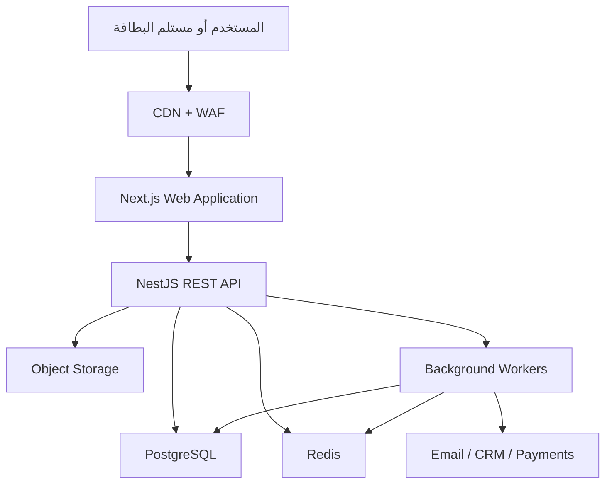

# التوصيات التقنية والمعمارية لمنصة البطاقات التعريفية الرقمية بنظام SaaS

**اسم الوثيقة:** Technical Architecture Recommendation  
**نوع النظام:** Digital Business Card SaaS Platform  
**الإصدار:** 1.0  
**التاريخ:** 12 أغسطس 2026  
**الحالة:** توصية تقنية للتصميم والتنفيذ

---

## 1. الملخص التنفيذي

توصي هذه الوثيقة ببناء المنصة باستخدام حزمة تقنية موحدة تعتمد على **TypeScript** في الواجهة الأمامية والخلفية، مع **PostgreSQL** كقاعدة البيانات الرئيسية، واتباع معمارية **Modular Monolith** متعددة المؤسسات في المراحل الأولى.

الحزمة التقنية المقترحة هي:

| الطبقة                  | التقنية المقترحة                              |
| ----------------------- | --------------------------------------------- |
| Front-end               | Next.js + React + TypeScript                  |
| UI System               | Tailwind CSS + shadcn/ui + Radix UI           |
| اللغات                  | next-intl مع دعم العربية وRTL                 |
| Back-end                | NestJS + Node.js 24 LTS + TypeScript          |
| API                     | REST API موثق باستخدام OpenAPI/Swagger        |
| ORM                     | Prisma ORM مع SQL Migrations للوظائف المتقدمة |
| قاعدة البيانات الرئيسية | Managed PostgreSQL                            |
| Cache وRate Limiting    | Redis                                         |
| Background Jobs         | BullMQ + Redis                                |
| الصور والملفات          | S3-compatible Object Storage + CDN            |
| الهوية والمصادقة        | Keycloak أو Auth0 عبر OpenID Connect          |
| الاختبارات              | Vitest/Jest + Playwright                      |
| التشغيل                 | Docker + Managed Container Platform           |
| المراقبة                | OpenTelemetry + Sentry + Grafana              |

التوصية النهائية المختصرة:

> **Next.js + NestJS + PostgreSQL + Redis + S3، باستخدام TypeScript، وضمن Modular Monolith متعدد المؤسسات.**

هذه الحزمة تحقق توازناً مناسباً بين سرعة تنفيذ المنتج الأولي، ودعم اللغة العربية، وأداء صفحات البطاقات العامة، وإدارة المؤسسات والاشتراكات، وقابلية التوسع إلى التكاملات والفعاليات وتطبيقات الهاتف لاحقاً.

---

## 2. المتطلبات المؤثرة في القرار التقني

تحتاج المنصة إلى دعم المتطلبات التالية:

### 2.1 المتطلبات الوظيفية

- صفحات بطاقات عامة تفتح بسرعة من QR وNFC.
- إنشاء البطاقة وتخصيصها ومعاينتها فورياً.
- دعم العربية والإنجليزية واتجاه RTL.
- حفظ بيانات البطاقة بصيغة vCard.
- تبادل بيانات التواصل وجمع موافقات المستخدمين.
- إدارة المؤسسات والموظفين والقوالب والصلاحيات.
- إدارة الاشتراكات والفواتير والباقات.
- التحليلات وقياس المشاهدات والنقرات والتحويل.
- التكامل مع CRM وأنظمة الهوية والموارد البشرية.
- إرسال البريد والإشعارات وتنفيذ المهام المجدولة.
- دعم NFC وApple Wallet وGoogle Wallet لاحقاً.
- توفير API وتطبيقات هاتف في مراحل لاحقة.

### 2.2 المتطلبات غير الوظيفية

- عزل بيانات كل مؤسسة عن المؤسسات الأخرى.
- سرعة فتح البطاقة العامة على الهاتف.
- قابلية التوسع عند زيادة عدد البطاقات والمشاهدات.
- حماية البيانات الشخصية وإدارة الموافقات.
- سجل تدقيق للعمليات المهمة.
- نسخ احتياطي واستعادة Point-in-Time Recovery.
- قابلية المراقبة وتتبع الأخطاء.
- إمكانية استضافة النظام والبيانات داخل بيئة يختارها مالك المنصة.
- عدم الارتباط التقني بمزود سحابي واحد قدر الإمكان.

---

## 3. الشكل المعماري المقترح



### 3.1 التطبيقات الرئيسية

تقسم المنصة في البداية إلى ثلاثة تطبيقات قابلة للنشر بصورة مستقلة:

| التطبيق | المسؤولية                                                |
| ------- | -------------------------------------------------------- |
| Web     | الموقع العام، صفحات البطاقات، لوحة المستخدم والمؤسسة     |
| API     | منطق الأعمال، الصلاحيات، البيانات، الاشتراكات والتكاملات |
| Worker  | الرسائل، التقارير، الاستيراد، التحليلات ومهام التكامل    |

### 3.2 هيكل المستودع البرمجي

يوصى باستخدام Monorepo:

```text
apps/
├── web/                 # Next.js
├── api/                 # NestJS REST API
└── worker/              # BullMQ workers

packages/
├── ui/                  # عناصر الواجهة ونظام التصميم
├── contracts/           # نماذج API والأنواع المشتركة
├── validation/          # Zod schemas وقواعد التحقق
├── database/            # Prisma schema والمهاجرات
├── observability/       # Logs, metrics and tracing
└── config/              # الإعدادات المشتركة
```

يمكن استخدام:

- `pnpm` لإدارة الحزم.
- Turborepo أو Nx لإدارة Monorepo.
- ESLint وPrettier لتوحيد جودة وتنسيق الشيفرة.

---

## 4. التوصية الخاصة بالواجهة الأمامية Front-end

## 4.1 التقنية الأساسية

يوصى باستخدام:

- Next.js باستخدام App Router.
- React.
- TypeScript.
- Server Components للصفحات العامة حيثما يناسب.
- Client Components للمحرر والنماذج ولوحات التحكم.
- Server-Side Rendering وCaching للبطاقات العامة.
- PWA لتوفير تجربة قريبة من تطبيق الهاتف.

يوفر Next.js بنية App Router ودعماً لمسارات المحتوى متعددة اللغات، ما يجعله مناسباً لبطاقات عربية وإنجليزية. راجع [Next.js App Router](https://nextjs.org/docs/app) و[Next.js Internationalization](https://nextjs.org/docs/app/guides/internationalization).

### 4.1.1 سبب الاختيار

المنصة تحتوي على نوعين من الواجهات:

1. **واجهة عامة:** البطاقة التي تفتح من QR أو NFC ويجب أن تكون سريعة وقابلة للمشاركة والفهرسة.
2. **واجهة تفاعلية:** محرر البطاقة ولوحات المستخدم والمؤسسة والإدارة.

يخدم Next.js النوعين من خلال Server Rendering وClient Interactivity في مشروع واحد.

## 4.2 تطبيقات الواجهة المقترحة

يمكن أن يتضمن تطبيق Web المساحات التالية:

```text
/(marketing)             # الموقع التعريفي والتسعير
/(public-card)/[slug]    # صفحة البطاقة العامة
/(auth)                  # التسجيل والدخول
/(dashboard)             # لوحة المستخدم
/(organization)          # لوحة المؤسسة
/(admin)                 # لوحة إدارة المنصة
```

ينبغي فصل Layout وصلاحيات كل مساحة بوضوح.

## 4.3 نظام التصميم UI Design System

يوصى باستخدام:

- Tailwind CSS للتنسيق.
- shadcn/ui كنقطة بداية للعناصر.
- Radix UI للعناصر التفاعلية الحساسة.
- Lucide Icons للأيقونات.
- CSS Logical Properties لدعم RTL.

يجب إنشاء Design System خاص بالمنصة يتضمن:

- الألوان والخطوط.
- أحجام النصوص والعناوين.
- الأزرار والحقول والقوائم.
- حالات الخطأ والنجاح والتحميل.
- الوضع الداكن والفاتح.
- معايير الوصول الرقمي.
- قواعد تصميم قوالب البطاقات.

## 4.4 محرك عرض البطاقات

لا يوصى ببناء كل قالب كبطاقة مستقلة ذات منطق خاص. الأفضل بناء **Card Rendering Engine** يستقبل:

- بيانات البطاقة.
- لغة العرض.
- تعريف القالب.
- إعدادات الألوان والخطوط.
- ترتيب الأقسام.
- قواعد إظهار الحقول.

مثال لتعريف جزء من القالب:

```json
{
  "templateKey": "professional-01",
  "version": 1,
  "layout": "centered",
  "sections": ["identity", "actions", "links", "documents"],
  "theme": {
    "primaryColor": "#0F766E",
    "borderRadius": "large"
  }
}
```

يجب حفظ Version للقالب حتى لا تتغير البطاقات المنشورة بصورة غير مقصودة عند تحديث القالب.

## 4.5 محرر البطاقة

يوصى أن يتضمن المحرر:

- نموذج البيانات في جانب.
- معاينة هاتف مباشرة في الجانب الآخر.
- تحديث فوري للمعاينة.
- Autosave للمسودة.
- حفظ يدوي واضح.
- Version أو Optimistic Concurrency لمنع تعارض التعديلات.
- ترتيب الأقسام بالسحب والإفلات في مرحلة لاحقة.
- معاينة العربية والإنجليزية.
- معاينة قبل النشر.

## 4.6 إدارة النماذج والتحقق

يوصى باستخدام:

- React Hook Form.
- Zod للتحقق من البيانات.
- مشاركة Validation Schemas بين Web وAPI عند ملاءمة ذلك.

تشمل قواعد التحقق:

- البريد الإلكتروني.
- أرقام الهاتف وصيغة الدولة.
- Slug البطاقة.
- الروابط الخارجية.
- حجم ونوع الملفات.
- طول النصوص.
- الحقول المطلوبة حسب الباقة والقالب.

يجب إعادة التحقق من جميع البيانات في Back-end، حتى لو تم التحقق منها في المتصفح.

## 4.7 إدارة البيانات والحالة

يوصى باستخدام:

- TanStack Query لإدارة Server State وAPI Cache.
- React Context للحالات الصغيرة مثل اللغة والاتجاه.
- Zustand فقط عند الحاجة إلى حالة معقدة في محرر البطاقة.

لا توجد حاجة لاستخدام Redux في المنتج الأولي ما لم تظهر حالة تطبيق معقدة تبرر ذلك.

## 4.8 دعم العربية والإنجليزية

يوصى باستخدام `next-intl` مع:

- مسارات مثل `/ar` و`/en` للموقع ولوحات التحكم.
- ترجمة عناصر واجهة النظام.
- اتجاه RTL تلقائي للعربية.
- تنسيق التواريخ والأرقام والعملات حسب Locale.
- محتوى بطاقة منفصل لكل لغة.

يجب فصل مفهومين:

- لغة واجهة المستخدم.
- لغة محتوى البطاقة المنشورة.

فقد يستخدم الموظف لوحة التحكم بالعربية وينشر بطاقة بالعربية والإنجليزية.

## 4.9 أداء البطاقة العامة

صفحة البطاقة العامة هي أهم نقطة أداء في المنصة، ويوصى بما يلي:

- تقديم الصفحة من خلال CDN.
- استخدام Server Rendering أو Cached Rendering.
- إلغاء Cache عند نشر تعديل جديد.
- تحسين الصور وتوليد WebP/AVIF.
- تحميل الخطوط بكفاءة.
- تقليل JavaScript في الصفحة العامة.
- توليد Open Graph Metadata للمشاركة في WhatsApp والمنصات الاجتماعية.
- استخدام رابط دائم لا يتغير بتغير البيانات.
- قياس Core Web Vitals.

## 4.10 PWA وتطبيق الهاتف

يوصى بالبدء بـPWA متجاوبة لأنها تغطي:

- إنشاء البطاقة وإدارتها.
- عرض QR من الهاتف.
- الوصول السريع من Home Screen.
- مشاركة الرابط.

يتم تطوير تطبيق Native باستخدام React Native/Expo لاحقاً إذا أثبتت الحاجة إلى:

- تكاملات NFC أعمق.
- Apple Watch أو Wear OS.
- مزامنة جهات الاتصال على الجهاز.
- مسح البطاقات باستخدام الكاميرا بصورة متقدمة.
- Push Notifications الأصلية.

## 4.11 اختبارات الواجهة

- Vitest لاختبارات الدوال والمكونات.
- React Testing Library لاختبارات السلوك.
- Playwright لاختبارات End-to-End.
- Storybook اختياري لتوثيق نظام التصميم.

يدعم Playwright اختبار Chromium وFirefox وWebKit ومحاكاة أجهزة الهاتف، وهو مهم للتحقق من صفحات البطاقة وvCard على بيئات متعددة. راجع [Playwright](https://playwright.dev/docs/intro).

---

## 5. التوصية الخاصة بالخلفية Back-end

## 5.1 التقنية الأساسية

يوصى باستخدام:

- Node.js 24 LTS.
- NestJS.
- TypeScript.
- REST API.
- OpenAPI/Swagger.

Node.js 24 هو إصدار LTS مدعوم بتاريخ إعداد الوثيقة، بينما يجب تثبيت إصدار Production محدد ومراجعته دورياً وفق سياسة الترقيات. راجع [Node.js Releases](https://nodejs.org/en/about/previous-releases).

## 5.2 سبب اختيار NestJS

يوفر NestJS:

- بنية Modules واضحة.
- Dependency Injection.
- Controllers وServices وProviders.
- Guards للمصادقة والصلاحيات.
- Validation Pipes.
- Interceptors وException Filters.
- تكاملاً مع OpenAPI.
- دعماً للمهام المجدولة وQueues وWebSockets.
- إمكانية فصل Microservices لاحقاً.

هذه الخصائص مناسبة لمنصة تتضمن المؤسسات، البطاقات، الصلاحيات، الاشتراكات، التحليلات والتكاملات. راجع [NestJS Modules](https://docs.nestjs.com/modules) و[NestJS Authorization](https://docs.nestjs.com/security/authorization).

## 5.3 النمط المعماري: Modular Monolith

يوصى بالبدء بـ**Modular Monolith** منظم، وليس Microservices.

الوحدات المقترحة:

```text
src/modules/
├── identity/
├── users/
├── organizations/
├── memberships/
├── authorization/
├── cards/
├── templates/
├── contacts/
├── consents/
├── analytics/
├── campaigns/
├── subscriptions/
├── billing/
├── files/
├── notifications/
├── integrations/
├── webhooks/
└── audit/
```

يحتوي كل Module منطقياً على:

- Controller أو Transport Layer.
- Application Services أو Use Cases.
- Domain Rules.
- Repository Interfaces.
- Persistence Adapters.
- DTOs وValidation.
- Authorization Policies.
- Unit وIntegration Tests.

## 5.4 لماذا لا نبدأ بـMicroservices؟

البدء بـMicroservices سيضيف مبكراً:

- تعقيد النشر والمراقبة.
- اتصالات شبكية بين الخدمات.
- صعوبة تتبع العمليات.
- معالجة اتساق البيانات الموزعة.
- تكلفة تشغيل وصيانة أعلى.
- صعوبة أكبر في التطوير والاختبار المحلي.

يدعم NestJS نمط Microservices عند الحاجة، ولذلك يمكن فصل وحدات مثبتة الحمل مستقبلاً. راجع [NestJS Microservices](https://docs.nestjs.com/microservices/basics).

الخدمات المرشحة للفصل لاحقاً:

- Analytics ingestion.
- OCR processing.
- CRM integrations.
- Email and notifications.
- AI processing.

يجب أن يتم الفصل بناءً على قياسات الأداء وحدود الملكية، وليس لمجرد توقع نمو مستقبلي.

## 5.5 تصميم REST API

يوصى بمسارات واضحة ومصدرة:

```text
/api/v1/auth
/api/v1/users
/api/v1/organizations
/api/v1/cards
/api/v1/templates
/api/v1/contacts
/api/v1/analytics
/api/v1/campaigns
/api/v1/subscriptions
/api/v1/integrations
/api/v1/webhooks
```

مع تطبيق:

- API Versioning.
- OpenAPI documentation.
- Pagination وFiltering وSorting.
- Error response format موحد.
- Request ID وCorrelation ID.
- Idempotency Keys للمدفوعات والعمليات الحساسة.
- توقيع Webhooks والتحقق منها.
- حدود حجم الطلب والملف.
- Rate Limiting حسب IP والمستخدم والمؤسسة.

لا توجد حاجة قوية إلى GraphQL في MVP. REST أبسط للتوثيق وتطبيقات الهاتف وWebhooks وتكاملات الشركات.

## 5.6 المصادقة وإدارة الهوية

لا يوصى ببناء نظام كلمات المرور والمصادقة من الصفر.

### الخيار الأول: Keycloak

مناسب عندما تكون الأولوية:

- التحكم بمكان استضافة الهوية.
- عملاء حكوميون ومؤسسات كبيرة.
- SSO.
- OpenID Connect وOAuth 2.0 وSAML.
- ربط LDAP وActive Directory.
- MFA.
- تخصيص شاشات الدخول.

يدعم Keycloak OIDC وOAuth 2.0 وSAML وربط LDAP وActive Directory ومزودي الهوية الخارجيين. راجع [Keycloak](https://www.keycloak.org/).

### الخيار الثاني: Auth0 أو خدمة Managed Identity

مناسب عندما تكون الأولوية:

- سرعة إطلاق MVP.
- تقليل عبء التشغيل والتحديثات الأمنية.
- Enterprise SSO وSCIM كخدمة.
- إدارة اتصالات Entra ID وOkta.

يدعم Auth0 SCIM لتوفير وإلغاء حسابات موظفي المؤسسات وربطها بمزودي SAML وOIDC. راجع [Auth0 SCIM](https://auth0.com/docs/authenticate/protocols/scim).

### القرار المقترح

- استخدام OpenID Connect كمعيار تكامل داخل المنصة.
- اختيار Keycloak عند أولوية التحكم والاستضافة الإقليمية.
- اختيار Auth0 عند أولوية سرعة الإطلاق وتقليل التشغيل.
- حفظ Memberships والأدوار المؤسسية التفصيلية في قاعدة بيانات المنصة.
- عدم الاعتماد على مزود الهوية وحده لفرض صلاحيات موارد المنصة.

## 5.7 الصلاحيات Authorization

تحتاج المنصة إلى RBAC مع إمكانية إضافة شروط على الموارد:

| الدور                | مثال للصلاحيات                      |
| -------------------- | ----------------------------------- |
| Platform Super Admin | إدارة المنصة والمؤسسات والباقات     |
| Organization Owner   | إدارة المؤسسة والاشتراك والمسؤولين  |
| Organization Admin   | إدارة الموظفين والقوالب والبطاقات   |
| Department Admin     | إدارة قسم أو فرع محدد               |
| Marketing Admin      | إدارة الهوية والحملات والتقارير     |
| Member               | إدارة بطاقته ضمن الحقول المسموح بها |
| Analyst              | قراءة التحليلات دون تعديل البيانات  |

يجب التحقق من:

1. هوية المستخدم.
2. المؤسسة النشطة.
3. عضوية المستخدم في المؤسسة.
4. الصلاحية المطلوبة.
5. ملكية المورد أو القسم عند الحاجة.

## 5.8 Background Jobs

يوصى باستخدام:

- BullMQ.
- Redis.
- تطبيق Worker مستقل.

BullMQ يوفر Queue مبنية على Redis ويدعم Workers وإعادة محاولة المهام الفاشلة. راجع [BullMQ](https://docs.bullmq.io/) و[BullMQ Retries](https://docs.bullmq.io/guide/retrying-failing-jobs).

المهام التي تنفذ في الخلفية:

- إرسال البريد والإشعارات.
- توليد صور البطاقة والخلفيات.
- توليد Wallet Passes.
- معالجة الصور.
- استيراد الموظفين.
- تصدير التقارير.
- مزامنة CRM.
- معالجة Webhooks.
- تجميع التحليلات.
- OCR.
- الذكاء الاصطناعي.

يجب ألا ينتظر المستخدم انتهاء هذه العمليات داخل طلب HTTP طويل.

### ضوابط Queue

- تحديد عدد المحاولات.
- Exponential Backoff.
- Dead-letter أو Failed Jobs handling.
- Idempotent job handlers.
- Job timeout.
- Concurrency limits.
- فصل Queues حسب طبيعة الحمل.
- إخفاء البيانات الشخصية من Logs.

## 5.9 الإشعارات والبريد

إنشاء Notification Service موحد يدعم:

- البريد الإلكتروني.
- إشعارات داخل المنصة.
- Push Notifications لاحقاً.
- SMS عند وجود حالة عمل معتمدة.

تخزن Templates بصورة مصدرة وتدعم العربية والإنجليزية. وينبغي تسجيل حالة الإرسال دون تخزين محتوى حساس أكثر من الحاجة.

## 5.10 المدفوعات والاشتراكات

يجب عزل Billing Module عن بقية منطق المنتج، وأن يتضمن:

- Plans.
- Prices.
- Entitlements.
- Subscriptions.
- Invoices.
- Payment transactions.
- Coupons.
- Webhook events.

المبادئ الأساسية:

- بوابة الدفع هي مصدر حالة الدفع، والمنصة مصدر صلاحيات المنتج.
- التحقق من توقيع Webhook.
- تخزين معرف الحدث لمنع المعالجة المكررة.
- استخدام Idempotency.
- عدم تخزين بيانات البطاقة البنكية داخل المنصة.
- فصل الدفع التجريبي عن الإنتاج.

## 5.11 التكاملات الخارجية

إنشاء Integration Framework موحد يتضمن:

- Connection configuration.
- Secret references.
- OAuth token lifecycle.
- Field mapping.
- Sync direction.
- Retry policy.
- Sync logs.
- Webhook subscriptions.
- Rate limits الخاصة بالمزود.

ابدأ بـWebhooks وCSV ثم أضف CRM حسب الأولوية التجارية.

---

## 6. التوصية الخاصة بقاعدة البيانات

## 6.1 قاعدة البيانات الرئيسية: PostgreSQL

يوصى باستخدام PostgreSQL كقاعدة البيانات التشغيلية الرئيسية.

### سبب الاختيار

بيانات المنصة مترابطة بطبيعتها:

- المؤسسة لديها أعضاء وأدوار.
- المستخدم لديه بطاقة أو عدة بطاقات.
- البطاقة لديها قالب وروابط ولغات.
- البطاقة تستقبل جهات اتصال وموافقات.
- جهة الاتصال ترتبط بموظف وحملة وفعالية.
- المؤسسة لديها اشتراك وفواتير.
- العمليات المهمة تحتاج Audit Trail.

هذه العلاقات والمعاملات تجعل PostgreSQL أنسب من MongoDB كقاعدة بيانات رئيسية.

يوصى باستخدام **Managed PostgreSQL** بدلاً من تشغيل القاعدة يدوياً، مع اختيار أحدث إصدار رئيسي مستقر ومدعوم من مزود الاستضافة.

## 6.2 ORM وإدارة المهاجرات

يوصى باستخدام Prisma ORM للأسباب التالية:

- Type-safe database client.
- مخطط بيانات واضح.
- سرعة تطوير CRUD.
- دعم PostgreSQL.
- إدارة المهاجرات.
- معاملات Transactions.

تدعم Prisma معاملات قاعدة البيانات ومهاجرات المخطط. راجع [Prisma Transactions](https://www.prisma.io/docs/orm/prisma-client/queries/transactions) و[Prisma Migrate](https://www.prisma.io/docs/orm/prisma-migrate).

### ضابط مهم

تستخدم SQL Migrations مباشرة للوظائف التي لا يغطيها ORM بصورة كاملة، مثل:

- Row-Level Security policies.
- PostgreSQL extensions.
- Partial indexes.
- Advanced constraints.
- Triggers عند وجود مبرر.
- Partitioning.

يجب مراجعة ملفات Migration داخل Git وعدم تعديل قاعدة الإنتاج يدوياً.

## 6.3 استراتيجية Multi-Tenancy

التوصية الأولية:

> **Shared Database + Shared Schema + organization_id**

مثال مبسط:

```sql
CREATE TABLE cards (
    id UUID PRIMARY KEY,
    organization_id UUID NOT NULL,
    owner_user_id UUID NOT NULL,
    slug TEXT NOT NULL,
    status TEXT NOT NULL,
    published_at TIMESTAMPTZ,
    created_at TIMESTAMPTZ NOT NULL,
    updated_at TIMESTAMPTZ NOT NULL,
    UNIQUE (organization_id, slug)
);
```

يضاف `organization_id` إلى جميع جداول بيانات المؤسسة، مع فهارس مركبة مناسبة.

### طبقات عزل البيانات

1. Tenant Context على مستوى الطلب.
2. التحقق من العضوية والصلاحية في Back-end.
3. تقييد الاستعلامات بـ`organization_id` داخل Repository.
4. PostgreSQL Row-Level Security كدفاع إضافي.
5. اختبارات آلية لمحاولات الوصول بين المؤسسات.
6. سجل تدقيق لمحاولات الإدارة والعمليات الحساسة.

توفر PostgreSQL سياسات Row-Level Security لتقييد الصفوف التي يمكن قراءتها أو تعديلها أو حذفها. راجع [PostgreSQL Row Security](https://www.postgresql.org/docs/current/ddl-rowsecurity.html).

مثال توضيحي:

```sql
ALTER TABLE cards ENABLE ROW LEVEL SECURITY;

CREATE POLICY cards_tenant_isolation ON cards
USING (
    organization_id = current_setting('app.organization_id')::uuid
)
WITH CHECK (
    organization_id = current_setting('app.organization_id')::uuid
);
```

عند استخدام Connection Pool يجب ضبط Tenant Context داخل Transaction باستخدام `SET LOCAL` أو آلية آمنة مكافئة، وتجنب بقاء سياق مؤسسة على اتصال يعاد استخدامه لمؤسسة أخرى.

## 6.4 نموذج البيانات الأساسي

### الهوية والمؤسسات

```text
users
organizations
organization_memberships
roles
permissions
membership_roles
```

### البطاقات والقوالب

```text
cards
card_localizations
card_links
card_blocks
card_publications
templates
template_versions
custom_domains
```

### جهات الاتصال والموافقات

```text
contacts
contact_consents
contact_notes
tags
contact_tags
follow_up_tasks
```

### الحملات والتحليلات

```text
campaigns
events
event_members
card_events
analytics_rollups
```

### الاشتراكات والفوترة

```text
plans
plan_features
prices
subscriptions
subscription_items
invoices
payment_transactions
```

### التكامل والتشغيل

```text
integration_connections
integration_sync_runs
webhook_endpoints
webhook_deliveries
notification_deliveries
audit_logs
outbox_events
```

## 6.5 استخدام JSONB

تستخدم أعمدة Relational للبيانات التي تحتاج إلى:

- التحقق والقيود.
- العلاقات.
- التقارير.
- البحث المتكرر.
- الفهرسة الواضحة.

ويستخدم JSONB في:

- إعدادات القالب المرنة.
- إعدادات العرض.
- Metadata غير الأساسية.
- خصائص تكامل تختلف حسب المزود.
- بيانات أحداث متغيرة البنية عند الحاجة.

توفر PostgreSQL نوع JSONB بصيغة محسنة للاستعلام والمعالجة مع دعم الفهرسة. راجع [PostgreSQL JSONB](https://www.postgresql.org/docs/current/datatype-json.html).

لا يوصى بحفظ البطاقة كاملة في JSONB واحد، لأن ذلك سيضعف القيود والتقارير وإدارة التغييرات.

## 6.6 المعرفات والتواريخ

- استخدام UUID للمعرفات العامة.
- عدم كشف أرقام تسلسلية سهلة التخمين في الروابط العامة.
- استخدام `TIMESTAMPTZ` لكل التواريخ التشغيلية.
- حفظ الوقت في UTC وعرضه حسب منطقة المستخدم.
- استخدام Soft Delete فقط عندما توجد حاجة قانونية أو تشغيلية واضحة.
- تطبيق سياسة احتفاظ وحذف على البيانات الشخصية.

## 6.7 الفهارس

أمثلة للفهرسة:

```sql
CREATE INDEX idx_cards_org_owner
ON cards (organization_id, owner_user_id);

CREATE UNIQUE INDEX idx_cards_public_slug
ON cards (slug)
WHERE status = 'published';

CREATE INDEX idx_contacts_org_created
ON contacts (organization_id, created_at DESC);

CREATE INDEX idx_card_events_card_time
ON card_events (card_id, occurred_at DESC);
```

تحدد الفهارس النهائية بعد مراجعة أنماط الاستعلام باستخدام `EXPLAIN ANALYZE` ومراقبة الاستعلامات.

## 6.8 البحث

ابدأ باستخدام قدرات PostgreSQL:

- B-tree indexes.
- `pg_trgm` للبحث التقريبي.
- Full-Text Search.
- GIN indexes.

توفر PostgreSQL بحثاً نصياً مع ترتيب النتائج وفهارس مناسبة. راجع [PostgreSQL Full-Text Search](https://www.postgresql.org/docs/current/textsearch.html).

لا توجد حاجة إلى Elasticsearch أو OpenSearch في MVP. يضاف محرك بحث منفصل فقط عندما تظهر متطلبات بحث وحجم لا يعالجهما PostgreSQL بكفاءة.

## 6.9 التحليلات والأحداث

في MVP:

- ترسل أحداث المشاهدة والنقر إلى Endpoint خفيف.
- يوضع الحدث في Queue.
- تكتب الأحداث إلى PostgreSQL على دفعات.
- تنشأ Rollups يومية أو ساعية للتقارير.
- لا تسجل بيانات شخصية غير ضرورية.
- توثق قواعد احتساب الزائر الفريد والتحويل.

عند زيادة الحمل:

- Partitioning زمني لجدول الأحداث.
- فصل مسار Analytics ingestion.
- إضافة مخزن تحليلي مثل ClickHouse إذا أصبحت الاستعلامات التحليلية تؤثر على قاعدة المعاملات.
- إبقاء PostgreSQL مصدراً للبيانات التشغيلية.

## 6.10 المعاملات وOutbox Pattern

تستخدم Transactions للعمليات التي يجب أن تنجح أو تفشل كوحدة واحدة، مثل:

- إنشاء مؤسسة وعضوية المالك.
- إضافة اشتراك وتفعيل Entitlements.
- إنشاء جهة اتصال وتسجيل الموافقة.

لضمان إرسال أحداث التكامل دون فقدانها، يوصى باستخدام Transactional Outbox:

1. حفظ التغيير وOutbox Event في Transaction واحدة.
2. Worker يقرأ Outbox.
3. ينشر المهمة أو ينفذ التكامل.
4. يسجل نجاح المعالجة بطريقة Idempotent.

## 6.11 النسخ الاحتياطي والاستعادة

يجب أن يدعم مزود PostgreSQL:

- Automated backups.
- Point-in-Time Recovery.
- تشفير النسخ الاحتياطية.
- الاحتفاظ وفق سياسة معتمدة.
- نسخة في موقع أو حساب منفصل عند الحاجة.
- اختبار استعادة دوري.

توثق PostgreSQL آلية Continuous Archiving وPoint-in-Time Recovery باستخدام WAL. راجع [PostgreSQL PITR](https://www.postgresql.org/docs/current/continuous-archiving.html).

---

## 7. Redis وBackground Infrastructure

Redis ليس بديلاً لقاعدة البيانات الرئيسية، وإنما يستخدم في:

- Cache.
- Rate Limiting.
- BullMQ Queues.
- Counters مؤقتة.
- Distributed Locks عند الحاجة.
- Idempotency records قصيرة العمر.
- إلغاء Cache بعد تعديل البطاقة.

Redis مناسب لتطبيق Rate Limiting موزع بسبب عملياته الذرية وحالته المشتركة بين خوادم التطبيق. راجع [Redis Rate Limiting](https://redis.io/docs/latest/develop/use-cases/rate-limiter/nodejs/).

### قواعد الاستخدام

- لا تخزن جهات الاتصال أو الاشتراكات في Redis وحدها.
- ضع TTL لكل Cache Key مناسب.
- صمم Cache invalidation بصورة واضحة.
- افصل مفاتيح Cache عن Queue namespaces.
- حدد سياسة Eviction مناسبة.
- اجعل الوظائف الحرجة تفشل بصورة آمنة عند تعطل Redis.

---

## 8. تخزين الصور والملفات

لا تحفظ الصور والملفات الثنائية داخل PostgreSQL.

استخدم Object Storage متوافقاً مع S3 لتخزين:

- الصور الشخصية.
- الشعارات.
- صور الغلاف.
- ملفات PDF والسير الذاتية.
- خلفيات الاجتماعات.
- ملفات Wallet.
- صادرات التقارير.

خدمات S3 مصممة لتخزين الملفات لتطبيقات الويب والهاتف مع قابلية توسع وتوفر مرتفعين. راجع [Amazon S3](https://docs.aws.amazon.com/AmazonS3/latest/userguide/Welcome.html).

### ضوابط رفع الملفات

- Signed Upload URLs.
- التحقق من MIME Type والامتداد.
- تحديد الحجم الأقصى.
- إعادة تسمية الملفات بمعرفات غير متوقعة.
- فحص الملفات المرفوعة.
- معالجة الصور في Worker.
- توليد أحجام متعددة وWebP/AVIF.
- منع الوصول العام للملفات الخاصة.
- Signed Download URLs للملفات المحمية.
- حذف الملفات وفق دورة حياة البيانات.
- تقديم الملفات العامة عبر CDN.

---

## 9. الأمان والخصوصية

## 9.1 المصادقة

- OpenID Connect.
- MFA للحسابات الإدارية.
- جلسات قصيرة مع Refresh آمن عند الحاجة.
- إلغاء الجلسات عند تغيير كلمة المرور أو تعطيل العضوية.
- حماية Cookies باستخدام `HttpOnly`, `Secure`, و`SameSite`.

## 9.2 صلاحيات الوصول

- Deny by default.
- RBAC على مستوى المؤسسة.
- Resource ownership checks.
- فصل صلاحيات Super Admin.
- Step-up authentication للعمليات الحساسة عند الحاجة.
- اختبارات Permission Matrix.

## 9.3 حماية API

- TLS فقط.
- WAF.
- Rate Limiting.
- Validation لكل المدخلات.
- CORS مقيد.
- CSRF protection عند استخدام Cookies.
- Security headers.
- منع Mass Assignment.
- توقيع Webhooks.
- إدارة Secrets خارج الشيفرة.

## 9.4 حماية البيانات الشخصية

- تقليل البيانات المجمعة Data Minimization.
- تسجيل الغرض والموافقة.
- فصل موافقة التواصل عن التسويق.
- تمكين الوصول والتصحيح والحذف والتصدير.
- تحديد فترات الاحتفاظ.
- تشفير البيانات أثناء النقل والتخزين.
- إخفاء البيانات الشخصية من Logs.
- سجل معالجة البيانات.
- آلية لإدارة حوادث الاختراق.
- تقييم نقل البيانات خارج السلطنة عند انطباقه.

ينبغي مواءمة التصميم مع قانون حماية البيانات الشخصية العُماني ولائحته التنفيذية. راجع [وزارة النقل والاتصالات وتقنية المعلومات — حماية البيانات الشخصية](https://mtcit.gov.om/sectors/governance/personal).

## 9.5 Audit Log

يسجل Audit Log العمليات ذات الأثر، مثل:

- الدخول الإداري.
- إضافة أو حذف موظف.
- تغيير دور أو صلاحية.
- تعديل قالب مؤسسي.
- نشر أو تعطيل بطاقة.
- تصدير جهات الاتصال.
- تغيير الاشتراك.
- تعديل إعداد تكامل.
- الوصول الإداري الاستثنائي.

ينبغي أن يحتوي السجل على:

- Actor.
- Organization.
- Action.
- Resource type and ID.
- Timestamp.
- Request ID.
- نتيجة العملية.
- Metadata محدودة لا تكشف أسراراً أو بيانات شخصية غير لازمة.

---

## 10. النشر والبنية التحتية

## 10.1 Docker

تغلف المكونات داخل Containers:

- Web container.
- API container.
- Worker container.

يساعد Docker على توحيد التشغيل بين التطوير والاختبار والإنتاج وفصل التطبيق عن البنية التحتية. راجع [Docker Overview](https://docs.docker.com/get-started/docker-overview/).

## 10.2 بيئة الاستضافة الأولية

يوصى باستخدام خدمات مُدارة:

- Managed Container Platform.
- Managed PostgreSQL.
- Managed Redis.
- S3-compatible Object Storage.
- CDN.
- WAF.
- Load Balancer.
- Secrets Manager.
- Managed DNS and TLS certificates.

لا يوصى باستخدام Kubernetes في MVP ما لم يكن لدى الفريق خبرة تشغيلية جاهزة أو متطلب مؤسسي واضح.

## 10.3 البيئات

- Local Development.
- Automated Test.
- Staging.
- Production.

يجب فصل ما يلي بين Staging وProduction:

- قواعد البيانات.
- Redis.
- مفاتيح API.
- حسابات الدفع.
- خدمات البريد.
- Object Storage buckets.
- مزود الهوية أو Realms/Applications.

## 10.4 CI/CD

يتضمن Pipeline المقترح:

1. تثبيت الحزم والتحقق من Lockfile.
2. Lint وType Check.
3. Unit Tests.
4. Integration Tests.
5. Security and dependency scanning.
6. Build containers.
7. نشر Staging.
8. End-to-End Tests.
9. موافقة نشر Production.
10. Database migration بطريقة آمنة.
11. Smoke tests بعد النشر.
12. Rollback عند فشل معايير الصحة.

استخدم Expand-and-Contract للمهاجرات التي تغير البيانات أو الأعمدة المستخدمة في الإنتاج.

---

## 11. المراقبة والاعتمادية

## 11.1 الأدوات المقترحة

- OpenTelemetry للتتبع والمقاييس.
- Sentry لأخطاء Front-end وBack-end.
- Grafana للوحات المؤشرات والتنبيهات.
- Structured JSON Logs.
- Correlation ID.
- Uptime monitoring.

يوفر OpenTelemetry APIs وSDKs لجمع Traces وMetrics وLogs في JavaScript وNode.js. راجع [OpenTelemetry JavaScript](https://opentelemetry.io/docs/languages/js/).

## 11.2 المقاييس الأساسية

- زمن فتح صفحة البطاقة P50/P95/P99.
- معدل أخطاء API.
- عدد الطلبات ومعدل الرفض.
- Database connection pool usage.
- الاستعلامات البطيئة.
- Redis latency and memory.
- Queue depth and job failures.
- Email delivery rate.
- Webhook success rate.
- CRM sync failures.
- معدل رفع الملفات الفاشل.

## 11.3 أهداف تشغيلية أولية

تحدد الأرقام النهائية وفق اتفاق مستوى الخدمة والميزانية، لكن يمكن بدء القياس بهذه الأهداف:

| المؤشر                     | الهدف الأولي                                  |
| -------------------------- | --------------------------------------------- |
| توفر صفحات البطاقات العامة | 99.9% شهرياً                                  |
| استجابة API الاعتيادية     | P95 أقل من 500 ms دون التكاملات الخارجية      |
| فتح البطاقة العامة         | P75 LCP أقل من 2.5 ثانية على اتصال هاتف معقول |
| فقدان البيانات المقبول     | وفق RPO معتمد وقريب من الصفر للمعاملات        |
| زمن الاستعادة              | وفق RTO معتمد ومختبر                          |

هذه أهداف مبدئية وليست التزاماً تعاقدياً قبل اختبار الحمل وتحديد تكاليف البنية.

---

## 12. استراتيجية الاختبارات

## 12.1 أنواع الاختبارات

- Unit Tests لمنطق الأعمال.
- Integration Tests مع PostgreSQL وRedis.
- Repository Tests للتحقق من Tenant Scope.
- API Contract Tests.
- End-to-End Tests باستخدام Playwright.
- Payment Webhook Tests.
- Queue and retry tests.
- Backup restore tests.
- Load tests لصفحات البطاقات ومسار التحليلات.
- Security tests ضمن دورة التطوير.

## 12.2 حالات اختبار حرجة

- مستخدم من مؤسسة A لا يستطيع قراءة أو تعديل بيانات مؤسسة B.
- تعطيل عضوية الموظف يمنع وصوله فوراً.
- تغيير البطاقة لا يغير رابط QR.
- إعادة Webhook دفع لا تنشئ فاتورة أو اشتراكاً مكرراً.
- إعادة Job لا ترسل جهة اتصال مرتين إلى CRM.
- حذف المستخدم يطبق سياسة الحذف على البيانات والملفات.
- البطاقة العربية تظهر باتجاه صحيح على الهاتف.
- vCard يعمل على iOS وAndroid.
- فشل Redis لا يؤدي إلى فقدان معاملة محفوظة في PostgreSQL.

---

## 13. تطبيق التقنيات على مراحل المشروع

| المرحلة              | التقنيات التي يتم تفعيلها                                         |
| -------------------- | ----------------------------------------------------------------- |
| التأسيس              | Monorepo، Next.js، NestJS، PostgreSQL، ORM، Docker، CI/CD         |
| البطاقة الأساسية     | Rendering Engine، Object Storage، CDN، QR، vCard، i18n/RTL        |
| MVP                  | Contacts، Consents، Redis، Queue، Analytics events، Monitoring    |
| الشركات              | Multi-tenant RBAC، قوالب مؤسسية، Billing، Audit Log متقدم         |
| الحضور المهني        | NFC، Wallet، Email signatures، Background generation              |
| الفعاليات والتكاملات | OCR workers، Webhooks، CRM adapters، Event analytics              |
| Enterprise           | SSO، SAML، SCIM، Dedicated tenant options، Advanced observability |

---

## 14. التقنيات غير الموصى بها في MVP

- Microservices متعددة من اليوم الأول.
- Kubernetes دون حاجة أو خبرة تشغيلية.
- MongoDB كقاعدة البيانات الرئيسية.
- Elasticsearch/OpenSearch قبل وجود حجم بحث حقيقي.
- ClickHouse قبل أن تؤثر التحليلات على PostgreSQL.
- تطبيقات هاتف أصلية قبل إثبات الحاجة.
- GraphQL دون حالة استخدام واضحة.
- تخزين الملفات داخل قاعدة البيانات.
- بناء نظام مصادقة وكلمات مرور مخصص.
- الذكاء الاصطناعي داخل العمليات الأساسية الحرجة.
- دمج Front-end وBack-end كلياً بطريقة تمنع تقديم API لتطبيقات أخرى.

---

## 15. المخاطر التقنية وطرق الحد منها

| الخطر                           | الأثر       | الإجراء المقترح                                           |
| ------------------------------- | ----------- | --------------------------------------------------------- |
| تسرب بيانات بين المؤسسات        | حرج         | Tenant Context + Repository Scope + RLS + اختبارات عزل    |
| بطء صفحات البطاقات              | مرتفع       | CDN + Cache + صور محسنة + تقليل JavaScript                |
| تضخم جدول التحليلات             | متوسط/مرتفع | Queue + Batch writes + Partitioning + Rollups             |
| تعطل التكامل الخارجي            | متوسط       | Queue + Retry + Idempotency + Circuit breaker عند الحاجة  |
| تعقيد القوالب                   | متوسط       | Rendering Engine + Template Versioning                    |
| اعتماد كبير على مزود سحابي      | متوسط       | Docker + PostgreSQL + S3 APIs + OIDC standards            |
| فشل مهاجرات قاعدة البيانات      | مرتفع       | مراجعة Migration + Staging + Expand-and-Contract + Backup |
| إساءة استخدام الصفحات العامة    | متوسط       | WAF + Rate Limit + Bot protection + Abuse reporting       |
| رفع ملفات ضارة                  | مرتفع       | Signed URLs + validation + scanning + private buckets     |
| ازدواج معالجة الدفع أو Webhooks | مرتفع       | Signatures + Idempotency keys + unique event IDs          |

---

## 16. القرارات المعمارية المعتمدة مبدئياً

| رقم     | القرار                                         | الحالة         |
| ------- | ---------------------------------------------- | -------------- |
| ADR-001 | استخدام TypeScript للواجهة والخلفية            | مقترح للاعتماد |
| ADR-002 | استخدام Next.js للويب والبطاقات العامة         | مقترح للاعتماد |
| ADR-003 | استخدام NestJS لخدمة API المستقلة              | مقترح للاعتماد |
| ADR-004 | البدء بـModular Monolith                       | مقترح للاعتماد |
| ADR-005 | استخدام PostgreSQL كقاعدة رئيسية               | مقترح للاعتماد |
| ADR-006 | Shared Schema Multi-Tenancy مع organization_id | مقترح للاعتماد |
| ADR-007 | استخدام RLS كدفاع إضافي وليس وحيداً            | مقترح للاعتماد |
| ADR-008 | استخدام Redis للـCache والQueues فقط           | مقترح للاعتماد |
| ADR-009 | استخدام S3-compatible storage للملفات          | مقترح للاعتماد |
| ADR-010 | اعتماد OIDC وعدم بناء المصادقة من الصفر        | مقترح للاعتماد |
| ADR-011 | REST API قبل GraphQL                           | مقترح للاعتماد |
| ADR-012 | PWA قبل تطبيقات الهاتف الأصلية                 | مقترح للاعتماد |

ينبغي إنشاء سجل ADR مستقل وتحديث حالة كل قرار إلى Accepted أو Superseded عند بدء التنفيذ.

---

## 17. الحزمة التقنية النهائية

### Front-end

```text
Next.js
React
TypeScript
Tailwind CSS
shadcn/ui + Radix UI
next-intl
React Hook Form + Zod
TanStack Query
Playwright
```

### Back-end

```text
Node.js 24 LTS
NestJS
TypeScript
REST + OpenAPI
Prisma ORM
BullMQ
OpenID Connect
OpenTelemetry
```

### Data and Infrastructure

```text
Managed PostgreSQL
Managed Redis
S3-compatible Object Storage
CDN + WAF
Docker
Managed Container Platform
Secrets Manager
CI/CD
```

---

## 18. التوصية النهائية

ينبغي بدء تطوير المنصة باستخدام **Next.js للواجهة، NestJS للخلفية، PostgreSQL للبيانات، Redis للـCache والمهام، وObject Storage للملفات**، مع نشر المكونات عبر Docker على خدمات مُدارة.

الأولوية المعمارية الأولى ليست فصل النظام إلى خدمات كثيرة، بل ضمان:

1. عزل بيانات المؤسسات.
2. صحة نموذج الصلاحيات.
3. سرعة صفحات البطاقات العامة.
4. دعم العربية وRTL من البداية.
5. تسجيل الموافقات وسجل التدقيق.
6. قابلية استبدال مزود الهوية والدفع والتخزين من خلال واجهات معيارية.
7. وجود اختبارات آلية ومراقبة وتشغيل قابل للاستعادة.

بعد قياس الاستخدام، يمكن فصل التحليلات أو OCR أو التكاملات إلى خدمات مستقلة دون تغيير جوهر المنتج.

---

## 19. المراجع الرسمية

- [Next.js Documentation](https://nextjs.org/docs)
- [Next.js App Router](https://nextjs.org/docs/app)
- [Next.js Internationalization](https://nextjs.org/docs/app/guides/internationalization)
- [Node.js Releases](https://nodejs.org/en/about/previous-releases)
- [NestJS Documentation](https://docs.nestjs.com/)
- [NestJS Authorization](https://docs.nestjs.com/security/authorization)
- [NestJS Microservices](https://docs.nestjs.com/microservices/basics)
- [Prisma Migrate](https://www.prisma.io/docs/orm/prisma-migrate)
- [Prisma Transactions](https://www.prisma.io/docs/orm/prisma-client/queries/transactions)
- [PostgreSQL Row Security](https://www.postgresql.org/docs/current/ddl-rowsecurity.html)
- [PostgreSQL JSONB](https://www.postgresql.org/docs/current/datatype-json.html)
- [PostgreSQL Full-Text Search](https://www.postgresql.org/docs/current/textsearch.html)
- [PostgreSQL Point-in-Time Recovery](https://www.postgresql.org/docs/current/continuous-archiving.html)
- [Redis Documentation](https://redis.io/docs/latest/)
- [Redis Rate Limiting](https://redis.io/docs/latest/develop/use-cases/rate-limiter/nodejs/)
- [BullMQ Documentation](https://docs.bullmq.io/)
- [Keycloak](https://www.keycloak.org/)
- [Auth0 SCIM](https://auth0.com/docs/authenticate/protocols/scim)
- [Amazon S3 Documentation](https://docs.aws.amazon.com/AmazonS3/latest/userguide/Welcome.html)
- [Docker Overview](https://docs.docker.com/get-started/docker-overview/)
- [Playwright Documentation](https://playwright.dev/docs/intro)
- [OpenTelemetry JavaScript](https://opentelemetry.io/docs/languages/js/)
- [وزارة النقل والاتصالات وتقنية المعلومات — حماية البيانات الشخصية](https://mtcit.gov.om/sectors/governance/personal)
