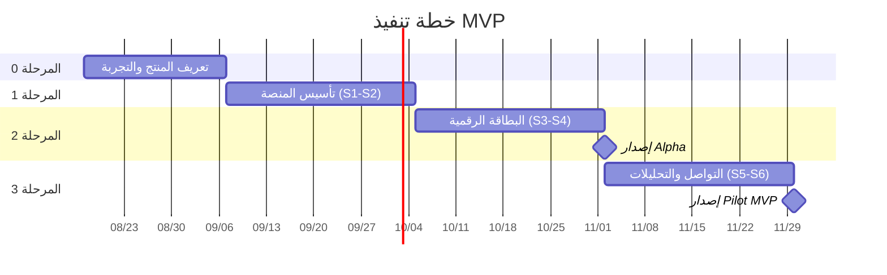

# خطة العمل التنفيذية لمنصة البطاقات التعريفية الرقمية

**اسم الوثيقة:** Execution Work Plan  
**المرجع:** [خارطة الطريق](Digital_Business_Card_SaaS_Roadmap_AR.md) + [التوصيات التقنية والمعمارية](Digital_Business_Card_SaaS_Technical_Architecture_AR.md)  
**الإصدار:** 1.0  
**التاريخ:** 12 أغسطس 2026  
**الحالة:** خطة تنفيذ مقترحة

---

## 1. الغرض من الوثيقة

تحوّل هذه الوثيقة المراحل الواردة في خارطة الطريق والقرارات الواردة في وثيقة المعمارية إلى **خطة تنفيذ زمنية قابلة للتتبع**: سبرنتات محددة، مهام تقنية، مخرجات، ومعايير إنجاز.

النطاق المُغطّى بالتفصيل هنا هو **المراحل 0 إلى 3 (نطاق MVP)** خلال 12–16 أسبوعاً، مع مخطط عالي المستوى للمراحل 4–7.

---

## 2. الافتراضات الحاكمة

هذه الافتراضات تؤثر على المدد والتسلسل، ويجب تأكيدها قبل بدء التنفيذ:

| #   | الافتراض                                                                                               | الأثر عند تغيّره                   |
| --- | ------------------------------------------------------------------------------------------------------ | ---------------------------------- |
| 1   | فريق متفرغ من 3–4 أشخاص: مطوّر Full-stack أول، مطوّر ثانٍ، مصمم UI/UX بدوام جزئي، مالك منتج بدوام جزئي | تغيّر عدد الأسابيع طردياً          |
| 2   | السبرنت مدته أسبوعان                                                                                   | يتغير عدد السبرنتات لا مجموع الجهد |
| 3   | ~~مزوّد الهوية~~ **قرار محسوم: Auth0** عبر OpenID Connect                                              | —                                  |
| 4   | بوابة الدفع تُختار قبل المرحلة 4 لا قبل ذلك                                                            | لا أثر على MVP                     |
| 5   | الاستضافة على خدمات مُدارة، بدون Kubernetes في MVP                                                     | وفق ADR ووثيقة المعمارية §10.2     |
| 6   | لا تطبيقات أصلية ولا ميزات ذكاء اصطناعي داخل MVP                                                       | وفق §14 من خارطة الطريق            |

> **قرارات محسومة:** مزوّد الهوية = **Auth0** (ADR-010).
>
> **قرارات ما زالت مطلوبة:** مزوّد الاستضافة والمنطقة الجغرافية للبيانات، اسم النطاق، وهوية المنصة البصرية الأولية.

### 2.1 نتائج قرار Auth0

| البند                                                                     | الأثر على الخطة                                                                                                                         |
| ------------------------------------------------------------------------- | --------------------------------------------------------------------------------------------------------------------------------------- |
| التحقق من البريد، استعادة كلمة المرور، MFA، الحماية من المحاولات المتكررة | جاهزة من المزوّد — تُحذف كمهام تطوير من S1 وتبقى كمهام **تهيئة واختبار**                                                                |
| Enterprise SSO (SAML/OIDC) وSCIM                                          | تصبح المرحلة 7 عملية **تهيئة** لا إعادة بناء                                                                                            |
| التسعير على أساس MAU                                                      | يُحتسب على أصحاب البطاقات والموظفين فقط؛ **زوّار البطاقة العامة مجهولون ولا يُحتسبون** — وهذا يحمي التكلفة عند نمو المشاهدات            |
| منطقة الـTenant تُختار عند الإنشاء ولا تتغير لاحقاً دون ترحيل             | **يجب حسمها مع قرار منطقة الاستضافة معاً**، ضمن تقييم نقل البيانات خارج السلطنة                                                         |
| المصادقة خارج بنيتنا                                                      | حذف الحساب يجب أن يُنفَّذ على **الطرفين**: قاعدة بياناتنا + Auth0 Management API                                                        |
| Auth0 Organizations متاحة كميزة                                           | **لا نعتمد عليها في MVP** — العضويات والأدوار تبقى في PostgreSQL وفق §5.6 من وثيقة المعمارية؛ تُستخدم لاحقاً لربط اتصالات SSO لكل مؤسسة |

---

## 3. الخريطة الزمنية العامة



| السبرنت | الأسابيع | المرحلة   | المخرج الرئيسي                                 |
| ------- | -------- | --------- | ---------------------------------------------- |
| S0      | 1–3      | المرحلة 0 | PRD + نموذج أولي معتمد + Backlog               |
| S1      | 4–5      | المرحلة 1 | Monorepo + بيئات + مصادقة تعمل                 |
| S2      | 6–7      | المرحلة 1 | Multi-tenancy + RBAC + i18n/RTL + خصوصية       |
| S3      | 8–9      | المرحلة 2 | نموذج البطاقة + المحرر + محرك العرض            |
| S4      | 10–11    | المرحلة 2 | النشر + الصفحة العامة + QR + vCard → **Alpha** |
| S5      | 12–13    | المرحلة 3 | نموذج التواصل + إدارة جهات الاتصال             |
| S6      | 14–15    | المرحلة 3 | التحليلات + لوحة المستخدم → **Pilot MVP**      |
| S7      | 16       | تثبيت     | إصلاح الملاحظات + اختبار حمل + أمان            |

---

## 4. المرحلة صفر — تعريف المنتج (S0، أسابيع 1–3)

لا تُكتب شيفرة منتج في هذه المرحلة، باستثناء إعداد المستودع الفارغ وأدوات العمل.

### 4.1 مسار المنتج

| المهمة                                                  | المخرج            | المسؤول          |
| ------------------------------------------------------- | ----------------- | ---------------- |
| 6–8 مقابلات مع أفراد وشركات صغيرة ومسؤول تسويق          | ملخص مشكلات مرتّب | مالك المنتج      |
| تحديد Value Proposition والباقات المبدئية               | صفحة واحدة معتمدة | مالك المنتج      |
| رسم رحلات المستخدم السبع (§5.3 من خارطة الطريق)         | خريطة رحلات       | المنتج + التصميم |
| كتابة PRD وتحويله إلى Epics/Stories/Acceptance Criteria | Backlog مرتّب     | مالك المنتج      |
| تحديد مؤشرات النجاح وقيمها المستهدفة                    | جدول KPI          | مالك المنتج      |

### 4.2 مسار التصميم

| المهمة                                                                  | المخرج          |
| ----------------------------------------------------------------------- | --------------- |
| Wireframes للشاشات الأساسية (تسجيل، محرر، بطاقة عامة، جهات اتصال، لوحة) | ملف تصميم       |
| نظام تصميم أولي: ألوان، خطوط عربية/لاتينية، مقاسات، حالات               | Design Tokens   |
| تصميم 3 قوالب بطاقة أولية بنسختين RTL وLTR                              | مواصفات القوالب |
| نموذج أولي قابل للنقر + اختباره مع 5 مستخدمين                           | تقرير الاختبار  |

### 4.3 مسار تقني تحضيري

- ~~اختيار مزوّد الهوية~~ — **تم: Auth0**. يُحدَّث ADR-010 إلى «اعتماد OIDC عبر Auth0، وعدم بناء المصادقة من الصفر» بحالة Accepted.
- اختيار مزوّد الاستضافة والمنطقة الجغرافية وتوثيق أثرها على متطلبات حماية البيانات.
- إعداد سجل ADR في المستودع وتحويل ADR-001…ADR-012 من "مقترح" إلى "معتمد" أو "معدّل".
- رسم نموذج البيانات الأولي للكيانات في §6.4 من وثيقة المعمارية.

### 4.4 بوابة الخروج من S0

- [ ] PRD معتمد وموقّع من صاحب القرار.
- [ ] نموذج أولي مُختبَر مع مستخدمين خارجيين وملاحظاتهم مدمجة.
- [ ] Backlog يغطي المراحل 1–3 على الأقل بمستوى Story.
- [ ] ADRs الأساسية معتمدة.

---

## 5. المرحلة الأولى — تأسيس المنصة (S1–S2، أسابيع 4–7)

### 5.1 السبرنت S1: الهيكل والبيئات والمصادقة

**المخرج:** مستخدم يستطيع التسجيل والدخول والخروج في بيئة Staging.

**مهام البنية**

1. إنشاء Monorepo بالهيكل الوارد في §3.2 من وثيقة المعمارية:
   ```text
   apps/web · apps/api · apps/worker
   packages/ui · contracts · validation · database · observability · config
   ```
2. `pnpm` + Turborepo + TypeScript + ESLint + Prettier + Husky.
3. تهيئة Next.js (App Router) وNestJS وتطبيق Worker فارغ.
4. `docker-compose` للتطوير المحلي: PostgreSQL + Redis + MinIO + مزوّد الهوية.
5. Prisma + أول Migration + سكربت Seed.
6. CI أولي: install → lint → typecheck → unit tests → build.
7. تجهيز بيئتي Staging وProduction وSecrets Manager.

**مهام المصادقة — Auth0**

8. إنشاء **ثلاثة Tenants منفصلة**: Development وStaging وProduction، مع اختيار المنطقة الجغرافية بعد حسم قرار الاستضافة.
9. تسجيل تطبيق Regular Web Application للـWeb، وتسجيل **API بمعرّف Audience** للـNestJS.
10. تكامل `@auth0/nextjs-auth0` في تطبيق Web: تسجيل الدخول والخروج والجلسة.
11. Guard في NestJS يتحقق من JWT عبر JWKS، مع التحقق الصارم من **Issuer وAudience وانتهاء الصلاحية**.
12. **User Provisioning:** Post-Login Action أو مزامنة عند أول طلب، تُنشئ سجل `users` محلياً مربوطاً بـ`auth0_user_id` كمعرّف خارجي ثابت.
13. تخصيص Universal Login: شعار المنصة، دعم العربية، واتجاه RTL.
14. تفعيل التحقق من البريد وسياسة كلمة المرور والحماية من المحاولات المتكررة (تهيئة، لا تطوير).
15. حماية Cookies (`HttpOnly`, `Secure`, `SameSite`) وضبط عمر الجلسة وRefresh.
16. Rate Limiting على مسارات API الحساسة عبر Redis (طبقة إضافية فوق حماية Auth0).
17. الأسرار (`AUTH0_DOMAIN`, `AUTH0_CLIENT_ID`, `AUTH0_CLIENT_SECRET`, `AUTH0_AUDIENCE`, `AUTH0_SECRET`) في Secrets Manager فقط.

> **قاعدة حاكمة:** Auth0 مصدر الهوية والمصادقة فقط. صلاحيات موارد المنصة والعضويات والأدوار تُفرض من قاعدة بياناتنا، ولا تُستمد من الـToken وحده.

**تعريف الإنجاز (DoD) للسبرنت**

- [ ] `pnpm dev` يشغّل المنصة كاملة محلياً بأمر واحد.
- [ ] Pipeline أخضر على كل Pull Request.
- [ ] دورة تسجيل ودخول واستعادة كاملة تعمل على Staging.
- [ ] لا أسرار داخل المستودع.

### 5.2 السبرنت S2: تعدد المؤسسات والصلاحيات واللغة والخصوصية

**المخرج:** عزل بيانات مثبت باختبارات آلية، وواجهة عربية/إنجليزية كاملة.

**مهام تعدد المؤسسات**

1. جداول `users`, `organizations`, `organization_memberships`, `roles`, `permissions`, `membership_roles`.
2. `organization_id` في كل جدول مؤسسي + فهارس مركبة.
3. Tenant Context Middleware على مستوى الطلب.
4. طبقة Repository تُجبر تقييد كل استعلام بـ`organization_id`.
5. سياسات RLS في PostgreSQL كطبقة دفاع ثانية، مع ضبط السياق بـ`SET LOCAL` داخل Transaction.
6. RBAC بالأدوار: Owner / Admin / Member، وDeny by default.
7. **اختبارات عزل آلية:** مستخدم من مؤسسة A يفشل في قراءة أو تعديل أو حذف أي مورد لمؤسسة B.

**مهام اللغة والتجربة**

8. `next-intl` مع مساري `/ar` و`/en` وRTL تلقائي.
9. Design System في `packages/ui`: Tailwind + shadcn/ui + CSS Logical Properties.
10. فصل «لغة الواجهة» عن «لغة محتوى البطاقة» في نموذج البيانات منذ الآن.
11. إعدادات المنطقة الزمنية وتنسيق التواريخ والأرقام.

**مهام الخصوصية والتشغيل**

12. سياسة الخصوصية وشروط الاستخدام وتسجيل الموافقات (موافقة التسويق منفصلة).
13. حذف الحساب + تصدير بيانات المستخدم.
14. `audit_logs` مع الحقول الواردة في §9.5 من وثيقة المعمارية.
15. Object Storage + رفع الصور بـSigned URLs + معالجة الصور في Worker.
16. خدمة البريد + قوالب عربية/إنجليزية.
17. المراقبة: OpenTelemetry + Sentry + Structured Logs + Correlation ID + Health Checks.
18. Feature Flags + لوحة Super Admin أولية.
19. تفعيل النسخ الاحتياطي التلقائي و**اختبار استعادة فعلي مرة واحدة**.

**بوابة الخروج من المرحلة الأولى**

- [ ] اختبارات العزل بين المؤسسات تمر، وتُشغَّل في CI عند كل تغيير.
- [ ] الواجهات الأساسية تعمل بالعربية والإنجليزية باتجاه صحيح.
- [ ] النسخ الاحتياطي مُفعّل و**الاستعادة مُختبَرة عملياً**.
- [ ] مراجعة أمنية أولية مكتملة وملاحظاتها الحرجة مغلقة.

---

## 6. المرحلة الثانية — البطاقة الرقمية (S3–S4، أسابيع 8–11)

### 6.1 السبرنت S3: نموذج البطاقة والمحرر ومحرك العرض

**مهام البيانات**

1. جداول `cards`, `card_localizations`, `card_links`, `card_blocks`, `templates`, `template_versions`.
2. حقول البطاقة وفق §7.2 من خارطة الطريق (الاسم بلغتين، المسمى، المؤسسة، الصور، النبذة، الهاتف، البريد، WhatsApp، الموقع، العنوان، الروابط الاجتماعية، رابط الحجز، أزرار CTA).
3. قيد `UNIQUE (organization_id, slug)` وسياسة توليد Slug والتحقق منه.
4. حد بطاقة واحدة للباقة المجانية عبر Entitlements بسيطة قابلة للتوسع لاحقاً.

**مهام محرك العرض**

5. **Card Rendering Engine** يستقبل: بيانات البطاقة + اللغة + تعريف القالب + الثيم + ترتيب الأقسام + قواعد الإظهار.
6. تنفيذ 3 قوالب أولية فوق المحرك نفسه، لا كصفحات مستقلة.
7. **Template Versioning:** البطاقات المنشورة لا تتغير عند تحديث القالب.

**مهام المحرر**

8. نموذج البيانات جانباً ومعاينة هاتف مباشرة جانباً آخر مع تحديث فوري.
9. React Hook Form + Zod، مع إعادة التحقق الكاملة في الـAPI.
10. Autosave للمسودة + حفظ يدوي واضح.
11. Optimistic Concurrency عبر حقل Version لمنع تعارض التعديلات.
12. تخصيص الألوان والخطوط، رفع الصورة والشعار والغلاف، ترتيب الحقول وإخفاؤها.
13. معاينة بالعربية والإنجليزية، ووضع داكن وفاتح.

### 6.2 السبرنت S4: النشر والصفحة العامة والمشاركة

**مهام دورة الحياة والنشر**

1. حالات: Draft → Preview → Published → Unpublished، مع `card_publications`.
2. **الرابط ثابت لا يتغير عند تحديث البيانات** — قاعدة اختبار حرجة.
3. صفحة عامة `/(public-card)/[slug]` بـServer Rendering وCache على CDN.
4. إبطال الـCache عند كل نشر.

**مهام المشاركة**

5. QR Code ديناميكي مرتبط بالرابط الثابت.
6. توليد vCard واختباره فعلياً على iOS وAndroid.
7. مشاركة عبر WhatsApp والبريد ونسخ الرابط.
8. روابط `tel:` و`mailto:` والخرائط مباشرة.
9. Open Graph Metadata لمعاينة الرابط في WhatsApp والشبكات الاجتماعية.
10. **فتح البطاقة دون تسجيل ودون تطبيق** — شرط غير قابل للتفاوض.

**مهام الأداء**

11. تحسين الصور وتوليد WebP/AVIF، وتحميل الخطوط العربية بكفاءة.
12. تقليل JavaScript في الصفحة العامة إلى الحد الأدنى.
13. قياس Core Web Vitals والهدف: **P75 LCP أقل من 2.5 ثانية**.
14. اختبارات Playwright على Chromium وWebKit ومحاكاة أجهزة هاتف.

**بوابة الخروج → إصدار Alpha**

- [ ] إنشاء بطاقة ونشرها في **أقل من خمس دقائق** لمستخدم جديد.
- [ ] QR وvCard يعملان على iOS وAndroid.
- [ ] تحديث البطاقة لا يستدعي إعادة إصدار QR.
- [ ] العرض صحيح على مقاسات الشاشات المختلفة وباتجاه RTL سليم.
- [ ] لا تتطلب المشاهدة حساباً ولا تطبيقاً.

---

## 7. المرحلة الثالثة — التواصل والتحليلات (S5–S6، أسابيع 12–15)

### 7.1 السبرنت S5: تبادل بيانات التواصل وإدارة جهات الاتصال

1. جداول `contacts`, `contact_consents`, `contact_notes`, `tags`, `contact_tags`, `follow_up_tasks`.
2. نموذج «شارك بياناتك معي» مع **موافقة صريحة مسجّلة** وحقول اختيارية قابلة للتخصيص.
3. حفظ جهة الاتصال وتسجيل الموافقة داخل **Transaction واحدة**.
4. رسالة تأكيد للزائر + رسالة شكر آلية + إشعار لصاحب البطاقة عبر Worker.
5. قائمة جهات الاتصال: بحث، تصفية، ملاحظات، تصنيفات، مصدر، حالة متابعة، تذكير.
6. اكتشاف التكرار الأساسي (بريد/هاتف) وتصدير CSV.
7. حماية النموذج العام: Rate Limiting + WAF + حماية من إساءة الاستخدام.

### 7.2 السبرنت S6: التحليلات ولوحة المستخدم

1. Endpoint خفيف لاستقبال الأحداث → Redis Queue → كتابة على دفعات إلى `card_events`.
2. جدول `analytics_rollups` مع تجميع ساعي/يومي عبر مهمة مجدولة.
3. المقاييس: المشاهدات، الزوار الفريدون، النقرات (هاتف/بريد/WhatsApp/روابط)، تنزيلات vCard، النماذج المكتملة، معدل التحويل.
4. **توثيق قاعدة احتساب الزائر الفريد والتحويل** كتابةً، وعدم تسجيل بيانات شخصية غير ضرورية.
5. التصفية حسب البطاقة والفترة الزمنية.
6. لوحة المستخدم: ملخص الأداء، أحدث جهات الاتصال، أكثر الروابط استخداماً، نشاط 7 و30 يوماً.
7. Transactional Outbox للأحداث التي ستُستخدم لاحقاً في التكاملات.

### 7.3 السبرنت S7: التثبيت قبل Pilot (أسبوع 16)

- إصلاح ملاحظات Alpha ذات الأولوية.
- اختبار حمل على الصفحة العامة ومسار التحليلات.
- مراجعة أمنية: Permission Matrix، رفع الملفات، الصفحات العامة، Logs خالية من البيانات الشخصية.
- توثيق التشغيل: Runbook، خطة الاستجابة للحوادث، دليل الدعم.
- تجهيز قنوات جمع الملاحظات من مستخدمي التجربة.

**بوابة الخروج → إصدار Pilot MVP**

- [ ] مستخدمون خارجيون يستخدمون المنصة فعلياً دون مساعدة.
- [ ] مؤشرات §8.7 من خارطة الطريق تُقاس فعلياً وتظهر في لوحة.
- [ ] لا مشكلات أمنية أو فقدان بيانات من الدرجة العالية.
- [ ] استقرار المشاركة والتواصل والتحليلات تحت الاستخدام الحقيقي.

---

## 8. ما بعد MVP — مخطط عالي المستوى

| المرحلة                                  | المدة التقديرية | نقطة القرار قبل البدء                    |
| ---------------------------------------- | --------------- | ---------------------------------------- |
| 4 — الشركات والاشتراكات                  | 4–6 أسابيع      | هل يطلب مستخدمو Pilot إدارة فرق فعلياً؟  |
| 5 — الحضور المهني (NFC/Wallet/التوقيعات) | 4–6 أسابيع      | هل تتكرر طلبات NFC والتوقيعات؟           |
| 6 — المبيعات والفعاليات والتكاملات       | 5–8 أسابيع      | هل توجد عقود تعتمد على CRM أو الفعاليات؟ |
| 7 — المؤسسات والذكاء الاصطناعي           | مستمرة          | وجود عميل مؤسسي يشترط SSO/SCIM           |

> القرار بين المرحلة 4 والمرحلة 6 يُتخذ ببيانات Pilot، لا بالتخطيط المسبق — وفق التوصية التنفيذية §18 من خارطة الطريق.

---

## 9. المهام المستمرة عبر كل السبرنتات

تُدرج هذه البنود في تعريف الإنجاز لكل سبرنت، لا كمهام منفصلة:

- كل استعلام مؤسسي مقيّد بـ`organization_id` ومغطى باختبار.
- كل مدخل يُتحقق منه في الـBack-end حتى لو تحقق منه المتصفح.
- كل عملية ذات أثر تُسجّل في Audit Log.
- كل نص واجهة له ترجمة عربية وإنجليزية.
- كل Migration مُراجَع في Git، ولا تعديل يدوي على الإنتاج.
- كل مهمة خلفية Idempotent ولها سياسة إعادة محاولة.
- تحديث توثيق OpenAPI مع كل تغيير في الـAPI.

---

## 10. أعلى خمسة مخاطر على الجدول الزمني

| الخطر                                             | الأثر                | الإجراء الوقائي                                       |
| ------------------------------------------------- | -------------------- | ----------------------------------------------------- |
| اختيار منطقة Auth0 Tenant قبل حسم منطقة الاستضافة | ترحيل مكلف لاحقاً    | تثبيت المنطقتين في قرار واحد قبل إنشاء Tenant الإنتاج |
| توسّع نطاق القوالب والتخصيص                       | يبتلع S3 وS4         | تجميد العدد عند 3 قوالب حتى ما بعد Pilot              |
| اكتشاف تسرب بيانات بين المؤسسات متأخراً           | إعادة عمل مكلفة      | اختبارات العزل من S2 وليس لاحقاً                      |
| ضعف أداء الصفحة العامة على الهاتف                 | يضرب القيمة الأساسية | قياس LCP من أول نشر في S4                             |
| بناء التكاملات أو الذكاء الاصطناعي مبكراً         | تأخير MVP دون عائد   | الالتزام بقائمة المؤجلات §14 من خارطة الطريق          |

---

## 11. أول خمس خطوات ملموسة للبدء

1. حسم القرارات الثلاثة المتبقية: مزوّد الاستضافة والمنطقة الجغرافية (مرتبط بمنطقة Auth0 Tenant)، النطاق، الهوية البصرية.
2. تهيئة المستودع (Git + Monorepo + CI) وسجل ADR بحالته المعتمدة.
3. بدء مقابلات المستخدمين بالتوازي مع التهيئة التقنية.
4. تحويل PRD إلى Backlog في أداة تتبع، مع وسم كل Story بالسبرنت المستهدف.
5. جدولة مراجعة بوابة خروج في نهاية كل مرحلة، بقائمة تحقق مكتوبة لا بتقدير شفوي.

---

## 12. المراجع

- [خارطة طريق تطوير المنصة](Digital_Business_Card_SaaS_Roadmap_AR.md)
- [التوصيات التقنية والمعمارية](Digital_Business_Card_SaaS_Technical_Architecture_AR.md)
