# دليل نمِقة

كل شاشة في المنصّة، وما تفعله بها.

> كل الصور في هذا الدليل لقطات فعلية من التطبيق، ببيانات نموذجية مُختلَقة لا تخصّ أحداً.

## الفهرس

**البداية**

1. [الدخول إلى نمِقة](#intro)
2. [لوحة التحكم](#dashboard)

**بطاقتك**

3. [قائمة البطاقات](#cards)
4. [إنشاء بطاقة](#card-new)
5. [محرر البطاقة](#card-editor)
6. [النشر والمشاركة](#publish)
7. [البطاقة كما يراها الزائر](#public-card)

**من تواصل معك**

8. [قائمة جهات الاتصال](#contacts)
9. [ملف جهة الاتصال](#contact-detail)

**الحضور في كل نقطة**

10. [وسوم NFC](#nfc)
11. [توقيع البريد وخلفية الاجتماع](#signature)
12. [الحملات](#campaigns)
13. [الفعاليات والمعارض](#events)
14. [مسح البطاقات الورقية](#scan)

**المؤسسة**

15. [الفريق](#team)
16. [الهوية المؤسسية](#branding)
17. [طلبات التعديل](#approvals)
18. [دليل الموظفين](#directory)
19. [التكاملات](#integrations)

**حسابك**

20. [الاشتراك والفوترة](#billing)
21. [الإعدادات وبياناتك](#settings)
22. [الدعم](#support)
23. [اللغة والمظهر](#language)

## البداية

ما الذي تقدّمه المنصّة، وكيف تقرأ أرقامك من أول يوم.

### 1. الدخول إلى نمِقة

نمِقة تحوّل بطاقتك التعريفية إلى صفحة حيّة برابط ثابت: تعدّل بياناتك مرة واحدة فيرى كل من يملك رابطك الجديد فوراً، والرابط نفسه ورمز QR المطبوع عليه لا يتغيران أبداً.

1. افتح nomiqa.om واضغط «ابدأ مجاناً».
2. سجّل الدخول ببريدك المهني. الدخول يمر عبر Auth0، فلا تُخزَّن كلمة مرورك لدينا.
3. بعد أول دخول تصل إلى لوحة التحكم مباشرة.

> **ملاحظة** — مبدّل اللغة ومبدّل المظهر في أعلى كل شاشة. لغة الواجهة منفصلة تماماً عن لغة البطاقة المنشورة — يمكنك استعمال اللوحة بالعربية ونشر بطاقة إنجليزية.

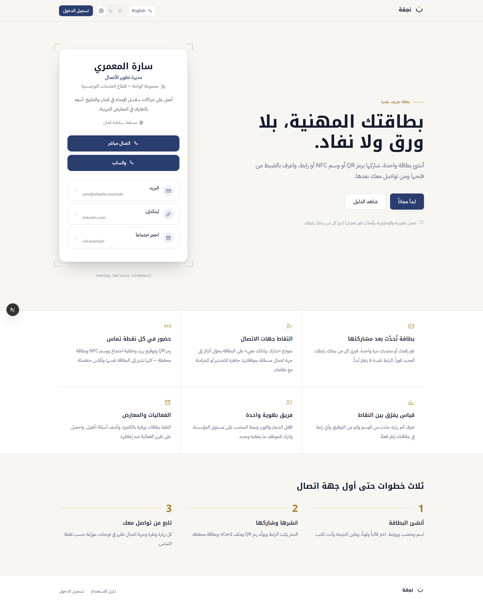

_الصفحة التعريفية — البطاقة في الأعلى هي بطاقة حقيقية معروضة بمحرّك العرض نفسه._

### 2. لوحة التحكم

تجيب أربعة أسئلة بترتيب مقصود: كيف أداء بطاقتي؟ من تواصل معي؟ أي الروابط يُستخدم فعلاً؟ ومن أي نقطة تماس جاءت الزيارات؟

1. اختر الفترة من المبدّل: ٧ أيام أو ٣٠ يوماً أو ٩٠ يوماً. الاختيار يُكتب في رابط الصفحة، فيمكنك مشاركته أو الرجوع إليه لاحقاً.
2. اقرأ صفّ المقاييس الستة. «جهات اتصال جديدة» مميّزة بلون ذهبي لأنها النتيجة التي تُقاس بها المنصّة، لا مجرد رقم زيارات.
3. في رسم النشاط، اليوم الذهبي هو يوم الذروة — ومكتوب صراحةً فوق الرسم.
4. قسم «الزيارات حسب نقطة التواصل» يفرّق بين رمز QR ووسم NFC وتوقيع البريد والحملة والمحفظة.

> **انتبه** — الأرقام تُجمَّع كل بضع دقائق لا فورياً، ووقت آخر تجميع معلن أسفل المبدّل. زيارة وقعت قبل لحظات قد لا تظهر بعد.
> **ملاحظة** — مجموع «الزيارات حسب نقطة التواصل» أقل دائماً من إجمالي المشاهدات: الرابط الذي تُشارِكه مباشرة لا يحمل مصدراً، وحشوه في خانة «أخرى» كان سيوحي بقياس لم يقع.

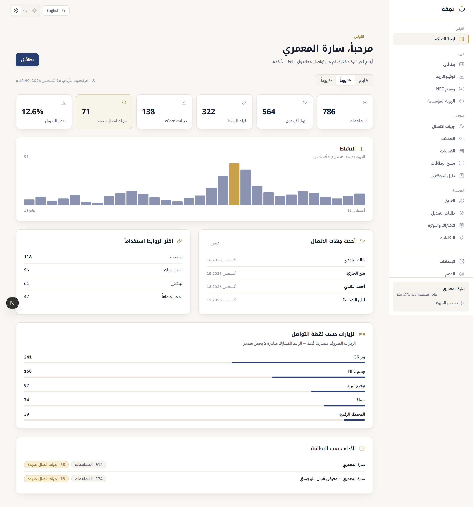

_لوحة التحكم بالوضع الفاتح._
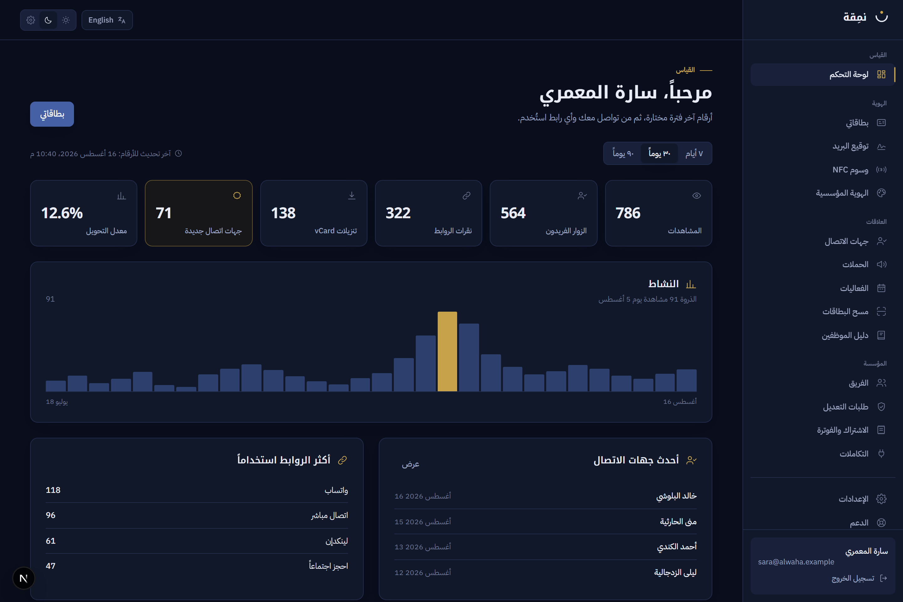

_الوضع الداكن — يُبدَّل من أعلى الشاشة ويُحفَظ لجهازك._

## بطاقتك

من الإنشاء إلى النشر إلى ما يراه الزائر على هاتفه.

### 3. قائمة البطاقات

كل بطاقاتك وحالتها في مكان واحد. يمكن أن تملك أكثر من بطاقة: واحدة عامة وأخرى للمعارض وثالثة بالإنجليزية.

1. كل بطاقة تعرض اسمها ورابطها العام وتاريخ آخر تعديل.
2. الشارة تقول الحالة: منشورة يراها الزوار، مسودة لا أحد يراها، وتعديلات غير منشورة تعني أن ما تراه أنت في المحرر ليس ما يراه الناس.
3. اضغط «تعديل» لفتح المحرر، أو «عرض البطاقة العامة» لترى ما يراه الزائر.

> **ملاحظة** — عدد البطاقات المسموح به يظهر تحت العنوان. حين تبلغ الحد يختفي زر الإنشاء وتظهر مكانه شارة توضّح السبب.

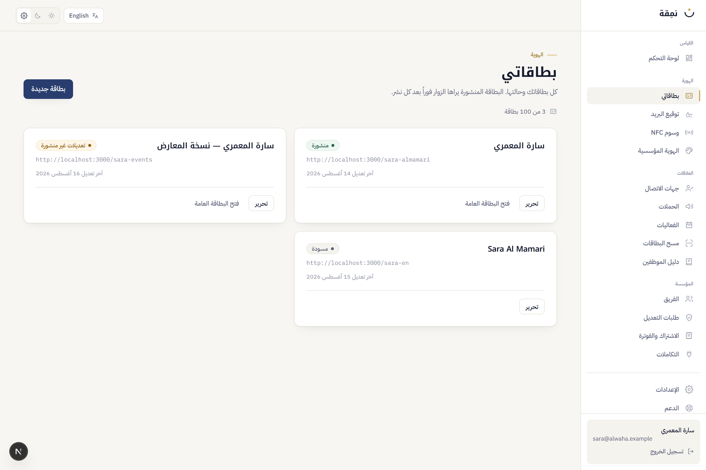

_ثلاث بطاقات بثلاث حالات مختلفة._

### 4. إنشاء بطاقة

الخطوة الأولى مختصرة عمداً: اسم وقالب ولغة. كل ما عداها يُضبط في المحرر بعد أن ترى شيئاً ملموساً أمامك.

1. اكتب الاسم الكامل كما تريده أن يظهر على البطاقة.
2. اختر لغة البطاقة الافتراضية. هذه لغة المحتوى المنشور لا لغة لوحتك.
3. اختر قالباً. الرسم المصغّر تحت كل اسم يوضّح ترتيب الأقسام: كلاسيكي بلا غلاف، وبغلاف بصورة علوية، ومبسّط بمحاذاة إلى البداية.
4. اضغط «إنشاء بطاقة» فينفتح المحرر مباشرة.

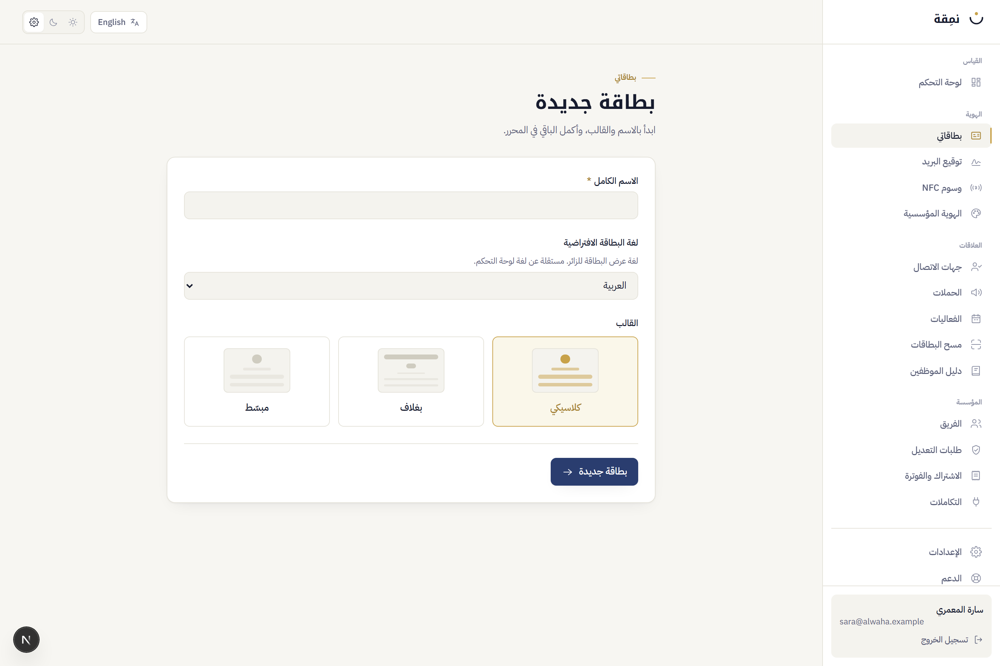

_ثلاثة حقول فقط، ثم إلى المحرر._

### 5. محرر البطاقة

كل ما يظهر على بطاقتك يُضبط من هنا، والمعاينة على اليسار تتحدّث وأنت تكتب — بمحرّك العرض نفسه الذي يخدم الصفحة العامة، فما تراه هو ما سيُنشر حرفياً.

1. المحتوى: الاسم والمسمى وجهة العمل والنبذة. مبدّل «العربية / English» أعلى القسم يحرّر النسخة الأخرى من المحتوى نفسه.
2. وسائل التواصل والروابط: أضف هاتفاً أو بريداً أو واتساب أو موقعاً أو حساب تواصل. الروابط المعلَّمة «زر رئيسي» تظهر كأزرار عريضة ملوّنة، والبقية كقائمة تحتها.
3. نموذج «شارك بياناتك معي»: معطَّل افتراضياً. تفعيله يضيف نموذجاً أسفل بطاقتك يحوّل الزائر إلى جهة اتصال مسجَّلة بموافقتها.
4. الصور: صورة شخصية وشعار وغلاف. الغلاف لا يظهر إلا في القوالب التي تدعمه.
5. المظهر: القالب واللون الأساسي واستدارة الحواف ووضع الألوان، ثم ترتيب أقسام البطاقة بالأسهم.
6. الرابط العام: يُحدَّد قبل أول نشر ويُقفَل بعده.

> **ملاحظة** — الحفظ تلقائي بعد ثانية ونصف من آخر تعديل، وحالته معلنة بجوار الأزرار في الأعلى.
> **انتبه** — الرابط العام يُقفَل بعد أول نشر ولا يمكن تغييره. السبب أن رمز QR ووسم NFC مطبوعان عليه: تغييره يعني أن كل نسخة مطبوعة تتوقف عن العمل.
> **انتبه** — النموذج يشترط بريداً أو هاتفاً على الأقل. جهة اتصال بلا قناة تواصل اسمٌ لا سبيل للردّ عليه.

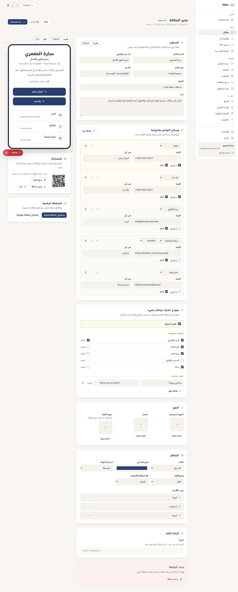

_المحرر كاملاً: النموذج في العمود الأول والمعاينة والمشاركة في الثاني._
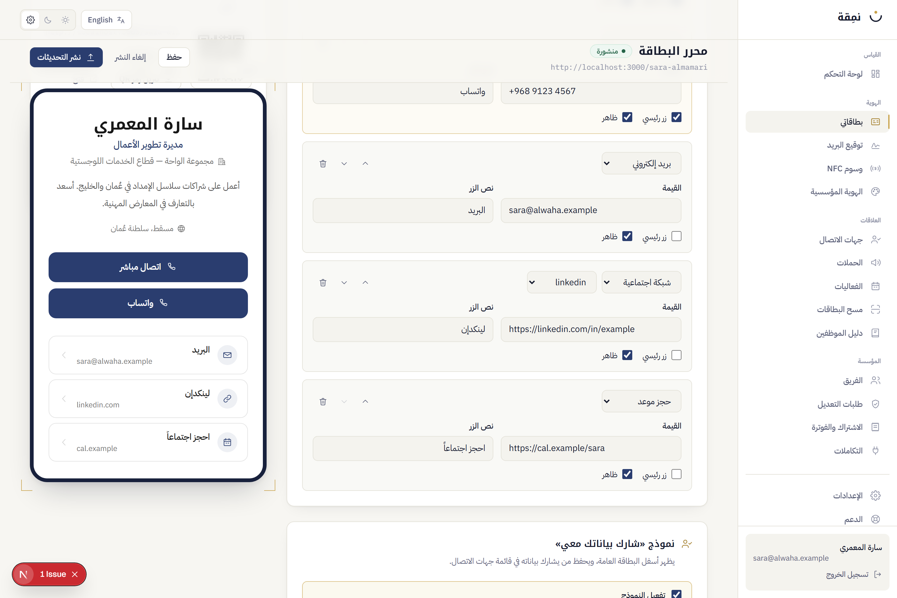

_محرر الروابط ونموذج التقاط جهات الاتصال عن قرب._

### 6. النشر والمشاركة

النشر يلتقط نسخة ثابتة من بطاقتك ويقدّمها للزوار. حتى تنشر، لا يرى أحد شيئاً.

1. اضغط «نشر». يُحفَظ العمل أولاً ثم يُنشر، فما يُنشر هو ما تراه بالضبط.
2. إن نقص شيء يمنع النشر، تظهر قائمة كاملة بما ينقص دفعة واحدة لا سبباً في كل محاولة.
3. بعد النشر يظهر صندوق «المشاركة»: رمز QR جاهز للطباعة، والرابط للنسخ، وزر لفتح البطاقة كما يراها الزائر.
4. صندوق «المحفظة الرقمية» يصدر بطاقة لـ Apple Wallet أو Google Wallet.

> **يفيدك** — تعديل البطاقة بعد النشر لا يستوجب إعادة طباعة رمز QR: الرمز يشير إلى الرابط الثابت لا إلى نسخة بعينها. اضغط «إعادة النشر» فقط.
> **ملاحظة** — بطاقة المحفظة لا تُصدَر إلا بعد النشر، لأنها تحمل رمزاً يشير إلى الرابط العام — وإصدارها قبله يضع في جيب المتلقي رمزاً معطّلاً.

_صندوقا المشاركة والمحفظة أسفل المعاينة، ولا يظهران إلا بعد النشر._

### 7. البطاقة كما يراها الزائر

الصفحة التي يفتحها من يمسح رمزك أو يلمس وسمك. تُفتح بلا تسجيل وبلا تطبيق، ومصمّمة لتُقرأ على هاتف واقفاً في قاعة معرض.

1. الاسم والمنصب وجهة العمل أولاً، ثم أزرار التواصل الرئيسية.
2. «حفظ جهة الاتصال» ينزّل ملف vCard يفتحه الهاتف مباشرة في دفتر العناوين.
3. أزرار المشاركة والنسخ وواتساب أسفلها، ومبدّل اللغة إن كانت البطاقة بلغتين.
4. إن فعّلت النموذج، يظهر «شارك بياناتك معي» أسفل البطاقة.

> **ملاحظة** — وضع الألوان هنا يتبع اختيارك أنت في المحرر لا تفضيل جهاز الزائر: بطاقة اخترت لها الوضع الفاتح تظهر فاتحة لزائر جهازه داكن.

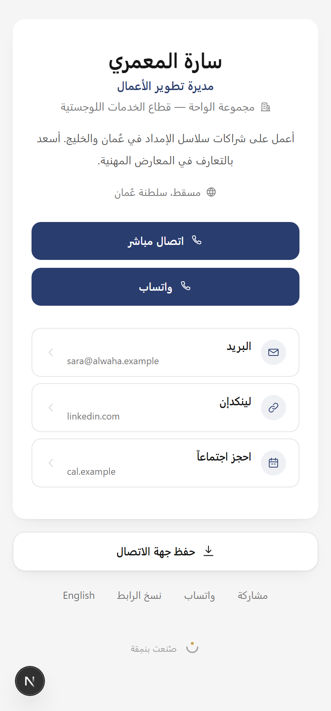

_البطاقة العامة على الهاتف._

_النسخة الداكنة من البطاقة نفسها._

## من تواصل معك

كل من ملأ نموذجك أو سلّمك بطاقته، في سجل واحد.

### 8. قائمة جهات الاتصال

كل جهة اتصال وصلتك من نموذج البطاقة أو من مسح بطاقة ورقية أو من استيراد، مع حالة متابعتها.

1. المقاييس الأربعة في الأعلى: جديدة، قيد المتابعة، آخر ٧ أيام، وتذكيرات مستحقة. الأخيرة تتلوّن حين يكون عليك متابعة فات موعدها.
2. صفِّ بالبحث أو بالبطاقة أو بالتصنيف أو بحالة المتابعة، ثم اضغط «تطبيق».
3. اضغط «تصدير CSV» لتنزيل ما تطابقه التصفية الحالية — لا الصفحة المعروضة وحدها.

> **يفيدك** — التصفية تعيش في رابط الصفحة. رابط «كل من قابلتهم في معرض عُمان» قابل للمشاركة مع زميلك وللعودة إليه من سجل المتصفح بعد أسبوع.
> **ملاحظة** — شارة «مكررة» تعني أن هذه الجهة تشبه جهة أقدم. لا تُحذف آلياً: القرار قرارك، وقد يكون الشخصان مختلفين فعلاً.

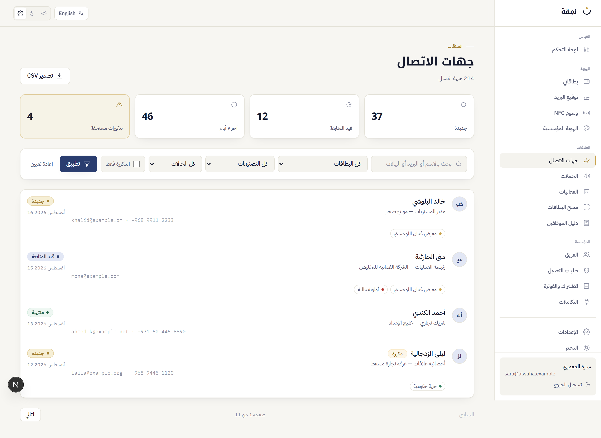

_القائمة مع شريط التصفية والمقاييس._

### 9. ملف جهة الاتصال

كل ما تعرفه عن جهة اتصال واحدة: بياناتها، ورسالتها، وملاحظاتك، ومهام متابعتك، وسجل موافقاتها.

1. حدّث حالة المتابعة والتصنيفات من أعلى الصفحة.
2. أضف ملاحظة داخلية. الملاحظات لك ولفريقك ولا تصل صاحب البيانات.
3. أضف مهمة متابعة بموعد. المهام المستحقة تظهر في مقياس «تذكيرات مستحقة».
4. راجع سجل الموافقات: ما وافق عليه الزائر بالضبط، ومتى، وبأي إصدار من النصّ.

> **انتبه** — موافقة الحفظ وموافقة الرسائل التسويقية منفصلتان. من وافق على حفظ بياناته لم يوافق بالضرورة على استقبال حملاتك.

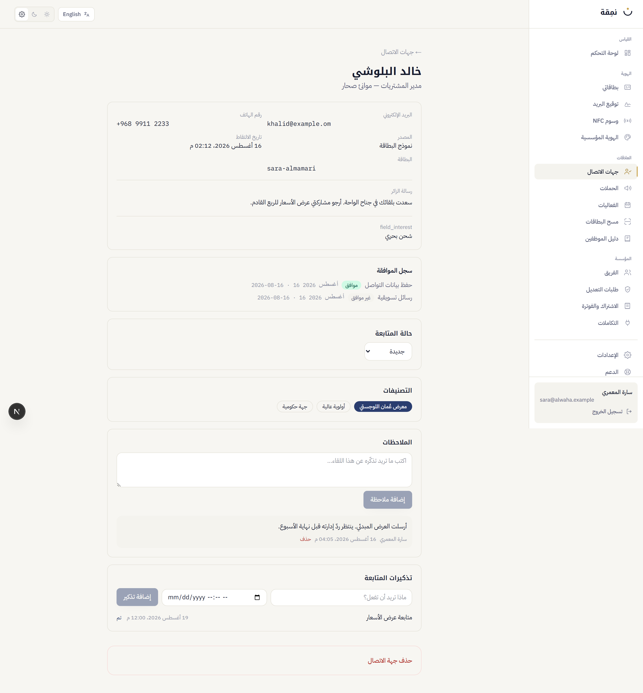

_الملف الكامل مع الملاحظات والمتابعات والموافقات._

## الحضور في كل نقطة

الوسم والتوقيع والحملة والفعالية — كلها تشير إلى بطاقتك، وكلها تُقاس منفصلة.

### 10. وسوم NFC

قطعة تلمسها بهاتف فتفتح بطاقتك. تُكتب مرة واحدة برابط ثابت، ثم تُعيد توجيهها أو تُبطلها من هنا دون لمس القطعة نفسها.

1. اضغط «إصدار وسم» فيتولّد كود قصير ورابط للكتابة.
2. اكتب الرابط على القطعة بأي تطبيق كتابة NFC.
3. اربط الوسم ببطاقة منشورة من القائمة المنسدلة داخل صفّه.
4. عند فقدان القطعة اضغط «إبطال» — يتوقف الرابط فوراً وتبقى الإحصاءات محفوظة.

> **يفيدك** — إعادة التوجيه لا تحتاج إعادة كتابة: الوسم يحمل الكود القصير لا رابط البطاقة، فتغيير البطاقة المرتبطة يكفي.

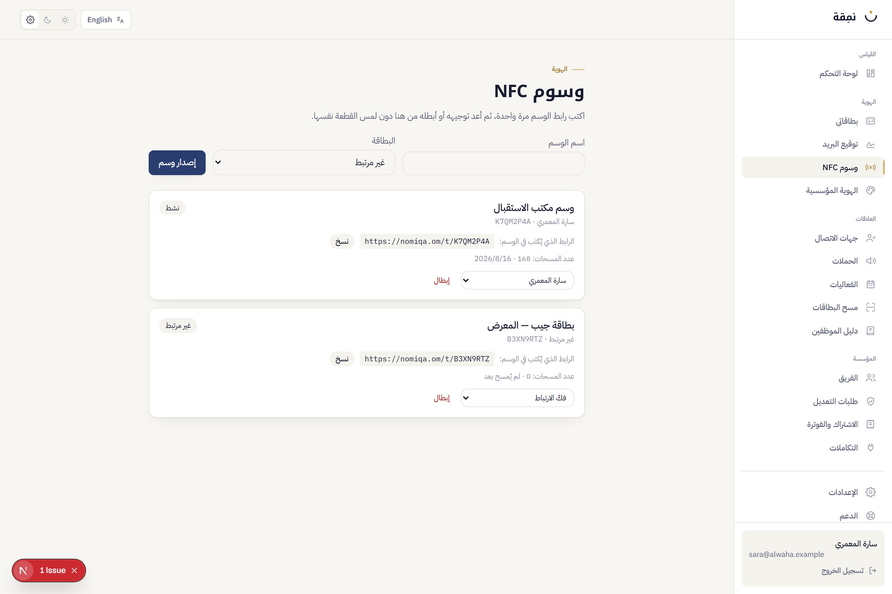

_وسم نشط مرتبط ببطاقة، وآخر أُصدر ولم يُربط بعد._

### 11. توقيع البريد وخلفية الاجتماع

توقيع يُبنى من بطاقتك المنشورة فيبقى محدّثاً بلا إعادة إنشاء، وخلفية اجتماع تحمل اسمك ورمز بطاقتك.

1. اختر البطاقة إن كنت تملك أكثر من واحدة.
2. اختر القالب واضبط ما يظهر: رمز QR، الصورة، الشعار، حسابات التواصل، ولون التمييز.
3. اضغط «نسخ HTML» ثم الصقه في إعدادات توقيع بريدك.
4. خلفية الاجتماع تُنزَّل صورةً جاهزة لمنصّة الاجتماعات التي تستعملها.

> **ملاحظة** — قد تفرض مؤسستك قالب توقيع موحّداً. في هذه الحالة تظهر لك ملاحظة صريحة وتُقفل الخيارات المفروضة.

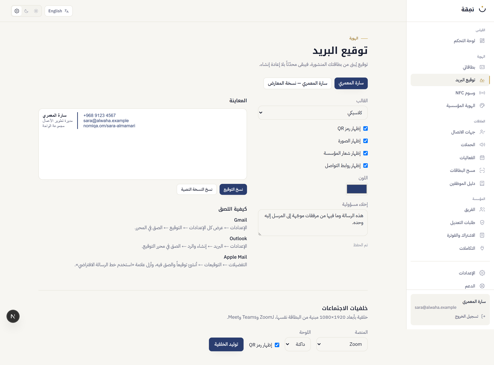

_استوديو التوقيع مع المعاينة وتعليمات اللصق._

### 12. الحملات

رمز مستقل لكل حملة، يقيس مصدر الزيارة ويظل يعمل بعد انتهاء الحملة — فلا تفقد زائراً وصل متأخراً.

1. أنشئ حملة باسمها والبطاقة التي تشير إليها ونافذتها الزمنية.
2. اضبط معاملات UTM لتظهر الحملة في تحليلاتك الخارجية أيضاً.
3. شارك رابط الحملة أو اطبع رمزها.
4. افتح تقرير الحملة لترى المشاهدات والزوار الفريدين ومعدل التحويل خلال النافذة وبعدها.

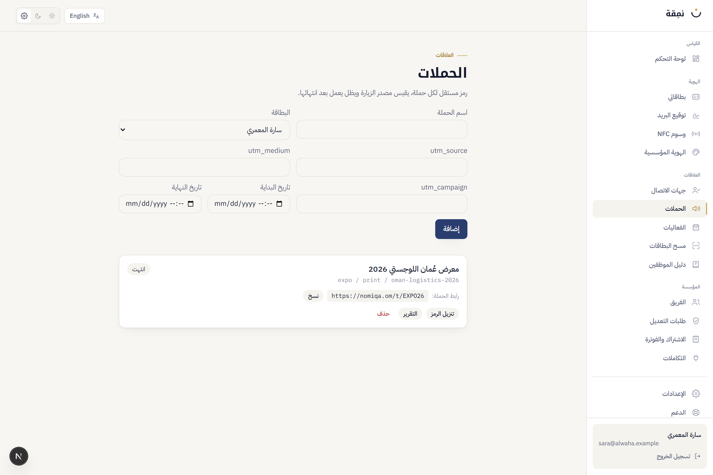

_قائمة الحملات مع نموذج الإنشاء._
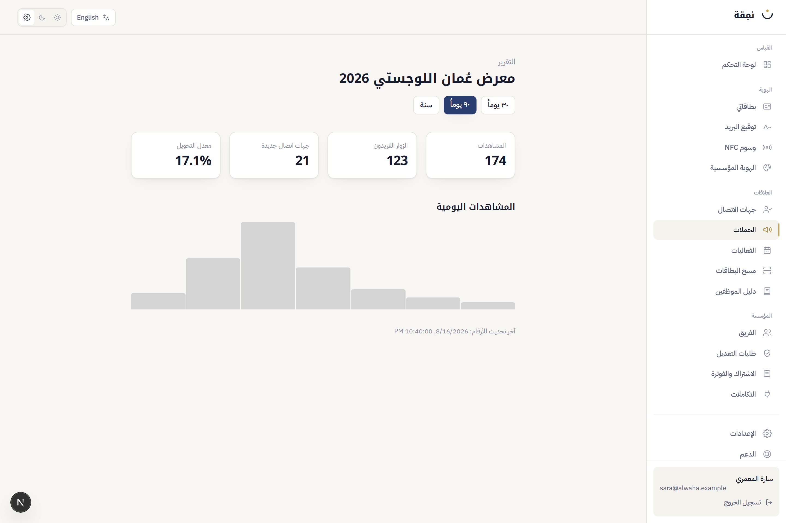

_تقرير حملة معرض._

### 13. الفعاليات والمعارض

الفعالية نافذة زمنية وبطاقات مخصّصة لها وأسئلة تأهيل. كل التقاط يقع عبرها داخل النافذة يُنسب إليها آلياً.

1. أنشئ الفعالية باسمها وموقعها ووقت بدايتها ونهايتها.
2. اختر البطاقات المستخدمة فيها، وأضف أسئلة التأهيل التي يجيب عنها فريقك عند كل التقاط.
3. أدخل التكلفة وعدد العملاء المستهدف لتحصل على تكلفة العميل الواحد في التقرير.
4. بعد انتهاء الفعالية افتح تقريرها: العملاء المحتملون، ونسبة المؤهَّلين، والتكرارات، وأداء كل عضو.

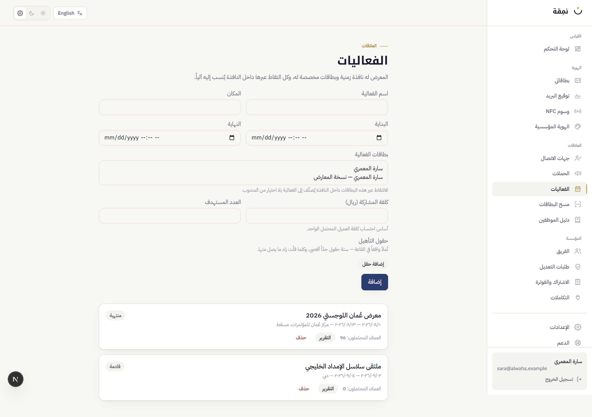

_فعالية منتهية وأخرى قادمة._
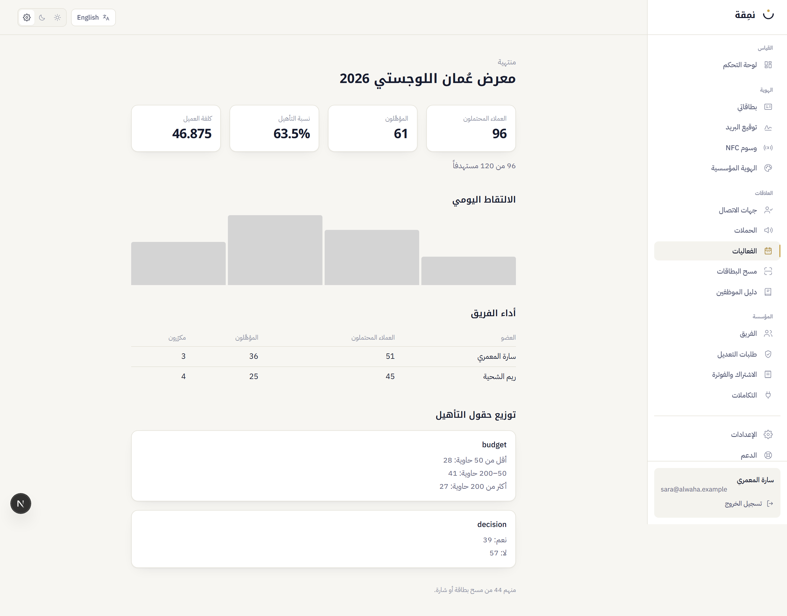

_تقرير الفعالية بعد إغلاقها._

### 14. مسح البطاقات الورقية

تُسلَّم لك بطاقة ورقية في معرض فتصوّرها بهاتفك، وتُستخرج بياناتها، وتراجعها، ثم تُحفَظ جهةَ اتصال.

1. اختر الفعالية الجارية إن كنت داخل واحدة.
2. صوّر البطاقة أو الشارة، أو أدخل البيانات يدوياً.
3. راجع ما استُخرج. الحقول منخفضة الثقة معلَّمة لتصحّحها قبل الحفظ.
4. اضبط الموافقة التسويقية إن منحها صاحب البطاقة شفهياً، ثم احفظ.

> **انتبه** — جهة اتصال محفوظة من بطاقة ورقية تُسجَّل بسند «تسليم بطاقة» لا بموافقة مقروءة، ولا تدخل أي حملة بريدية إلا بموافقة لاحقة صريحة.

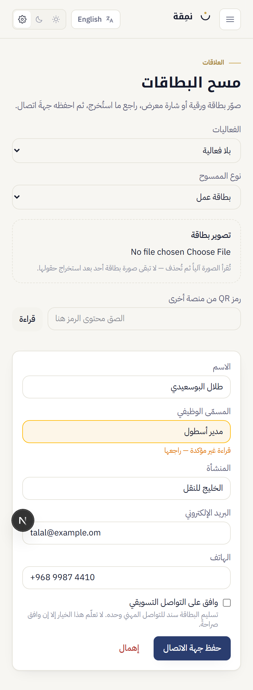

_شاشة المسح على الهاتف — تُفتح وقوفاً لا من مكتب._

## المؤسسة

فريق بهوية واحدة، وحدود واضحة لمن يعدّل ماذا.

### 15. الفريق

الأعضاء والدعوات والإدارات والفروع والاستيراد الجماعي في شاشة واحدة — لأن من يضيف موظفاً يحتاج رؤية المقاعد المتبقية والإدارات المتاحة في اللحظة نفسها.

1. ادعُ موظفاً ببريده ودوره وإدارته وفرعه ومسماه الوظيفي.
2. راجع الدعوات المعلّقة وتواريخ انتهائها.
3. من جدول الأعضاء عدّل الدور أو الإدارة أو الفرع، أو أنهِ خدمة عضو.
4. ابنِ الهيكل: إدارات متداخلة وفروع بمدنها.
5. للفرق الكبيرة استعمل الاستيراد الجماعي بملف CSV، مع خيار إرسال الدعوات وإنشاء البطاقات تلقائياً.

> **ملاحظة** — عدد المقاعد المستهلكة والمتاح يظهر أعلى الصفحة، ويُحذَّر قبل النموذج لا بعده — فلا تكتب بريد موظف ثم يُرفض.
> **انتبه** — إنهاء الخدمة يوقف وصول العضو ويُخفي بطاقاته، ولا يحذف جهات الاتصال التي التقطها للمؤسسة.

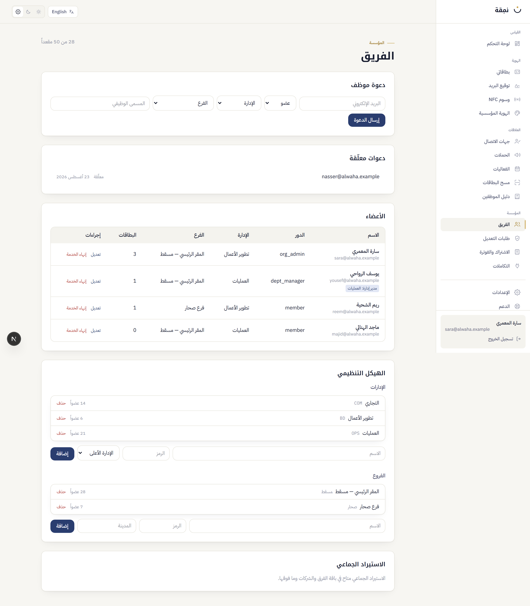

_الشاشة كاملة: الدعوة، الأعضاء، الهيكل، الاستيراد._

### 16. الهوية المؤسسية

اقفل ما يجب أن يكون موحّداً — الشعار واللون ونمط المسمى — واترك للموظف ما يخصّه وحده.

1. اضبط طقم الهوية: الألوان والخط والشعار والغلاف.
2. أنشئ سياسة لكل إدارة أو فرع، وحدّد الحقول المقفلة والقالب المفروض.
3. فعّل «يتطلب موافقة» إن أردت مراجعة تعديلات الموظفين قبل نشرها.
4. اربط نطاقاً مخصّصاً لبطاقات مؤسستك وأضف سجل التحقق لدى مزوّد نطاقك.

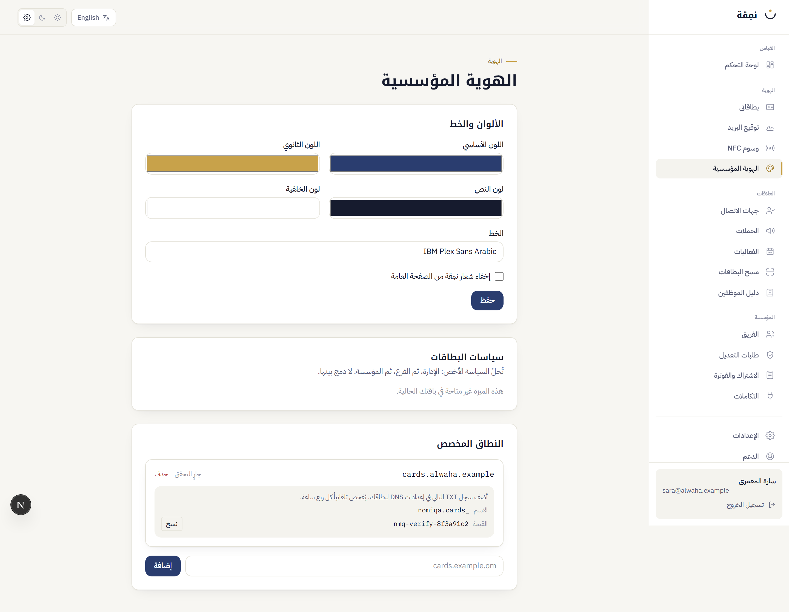

_طقم الهوية والسياسات والنطاق المخصّص._

### 17. طلبات التعديل

حين تفرض سياسة موافقة، يصل تعديل الموظف إلى هنا قبل أن يراه أحد.

1. راجع الطلبات المنتظرة: من طلبها، وأي الحقول تغيّرت، ومتى.
2. افتح الطلب لترى القيمة الحالية والقيمة المقترحة جنباً إلى جنب.
3. وافق أو ارفض مع ملاحظة تصل صاحب الطلب.
4. تبويب «طلباتي» يعرض ما أرسلته أنت وحالته.

> **ملاحظة** — طلب بُني على نسخة قديمة من البطاقة يظهر معلَّماً بأنه غير قابل للتطبيق، فلا تُطبَّق تعديلات فوق تعديلات لم يرها صاحبها.

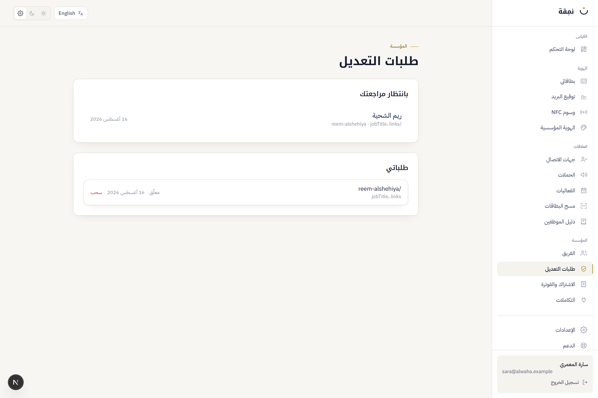

_طابور المراجعة وطلباتك المرسلة._

### 18. دليل الموظفين

كل بطاقات المؤسسة المنشورة في مكان واحد — للبحث الداخلي ولمشاركة بطاقة زميل مع عميل.

1. ابحث بالاسم أو المسمى.
2. صفِّ بالإدارة أو الفرع.
3. افتح بطاقة أي زميل أو انسخ رابطها.

> **ملاحظة** — ظهور العضو في الدليل خيار في ملفه داخل شاشة الفريق، ولا يُفعَّل لمن أُنهيت خدمته.

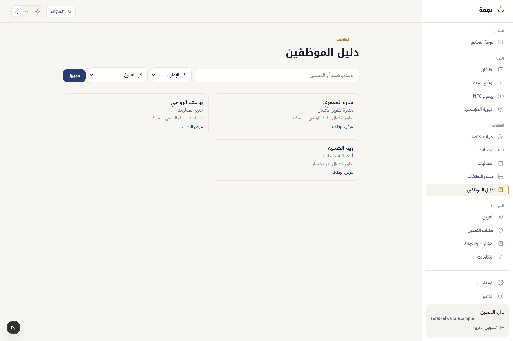

_الدليل الداخلي مع البحث والتصفية._

### 19. التكاملات

قنوات خروج بيانات مؤسستك إلى أنظمة أخرى: مفتاح API، ووجهات Webhook، ووصلة CRM.

1. أنشئ مفتاح API بصلاحيات محدّدة. المفتاح يظهر مرة واحدة فقط عند إنشائه.
2. أضف وجهة Webhook واختر الأحداث التي تريد إشعاراً بها.
3. اربط CRM واضبط خريطة الحقول ومن يُسجَّل مالكاً للعميل المحتمل.
4. راجع سجلّات التسليم والمزامنة عند أي تأخر.

> **انتبه** — وجهة تفشل مراراً تُعطَّل تلقائياً مع سبب معلن، حتى لا تتراكم محاولات على عنوان لم يعد يعمل.
> **ملاحظة** — مزامنة CRM في اتجاه واحد: من نمِقة إليه. ويمكن قصرها على من منح الموافقة التسويقية وحده.

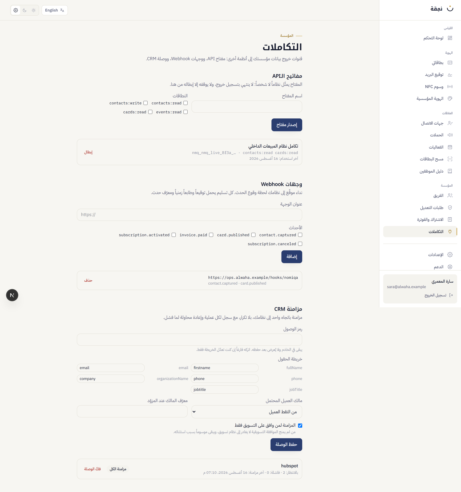

_المفاتيح والوجهات ووصلة CRM._

## حسابك

الاشتراك والفوترة وبياناتك الشخصية والدعم.

### 20. الاشتراك والفوترة

باقتك الحالية وحدودها واستهلاكك، وفواتيرك وسجل مدفوعاتها.

1. راجع الباقة الحالية والمقاعد المستهلكة وموعد التجديد.
2. قارن الباقات وغيّر باقتك. تظهر لك معاينة بالفرق المستحق قبل التأكيد.
3. افتح أي فاتورة لعرضها أو طباعتها. الفاتورة مستند ضريبي يخرج بلا واجهة عند الطباعة.
4. ادفع الفواتير المفتوحة عبر بوابة الدفع.

> **انتبه** — النزول إلى باقة أدنى قد يمنعه استهلاكك الحالي. تظهر لك أسباب المنع والميزات التي ستفقدها قبل التأكيد.

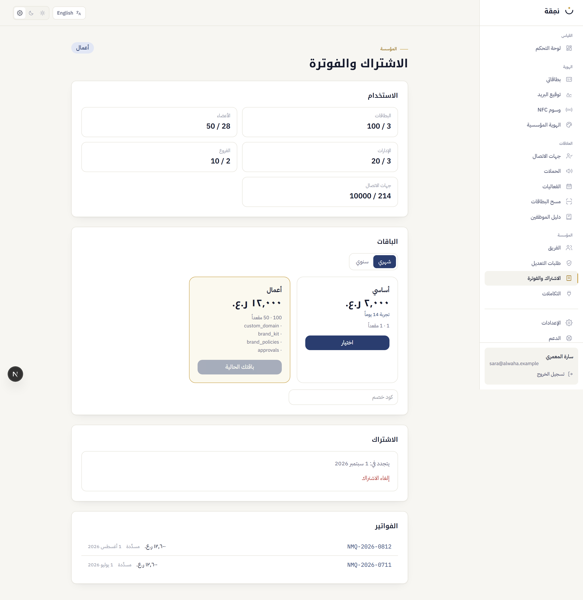

_الاشتراك والباقات والفواتير._
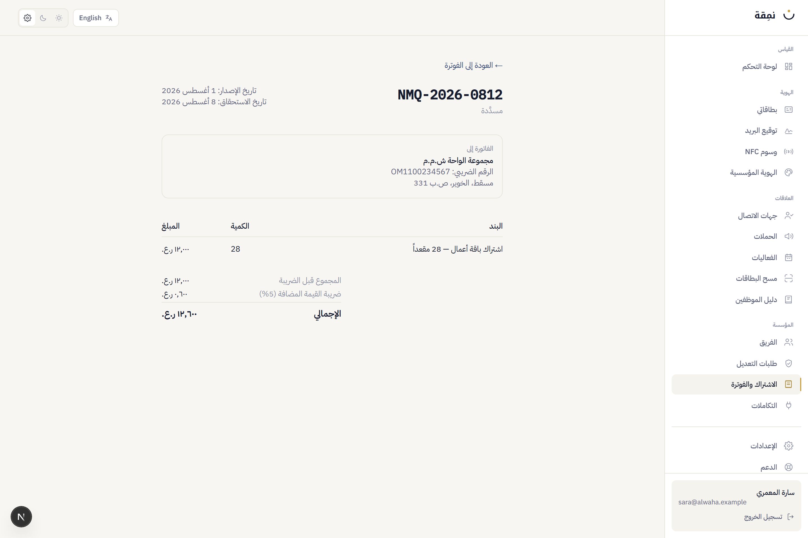

_فاتورة جاهزة للطباعة._

### 21. الإعدادات وبياناتك

ملفك الشخصي، وموافقاتك، وما يمكنك فعله ببياناتك.

1. حدّث اسمك ولغة واجهتك ومنطقتك الزمنية.
2. راجع موافقاتك. الموافقة التسويقية اختيارية دائماً ويمكن سحبها.
3. نزّل نسخة كاملة من بياناتك بصيغة JSON.
4. احذف حسابك نهائياً بكتابة كلمة التأكيد.

> **انتبه** — حذف الحساب لا رجعة فيه. ما يُحذف وما يبقى ولماذا موثّق في صفحة سياسة الحذف.
> **ملاحظة** — تغيير البريد يتطلب إعادة تحقّق عبر الدعم، لأنه معرّف الدخول نفسه.

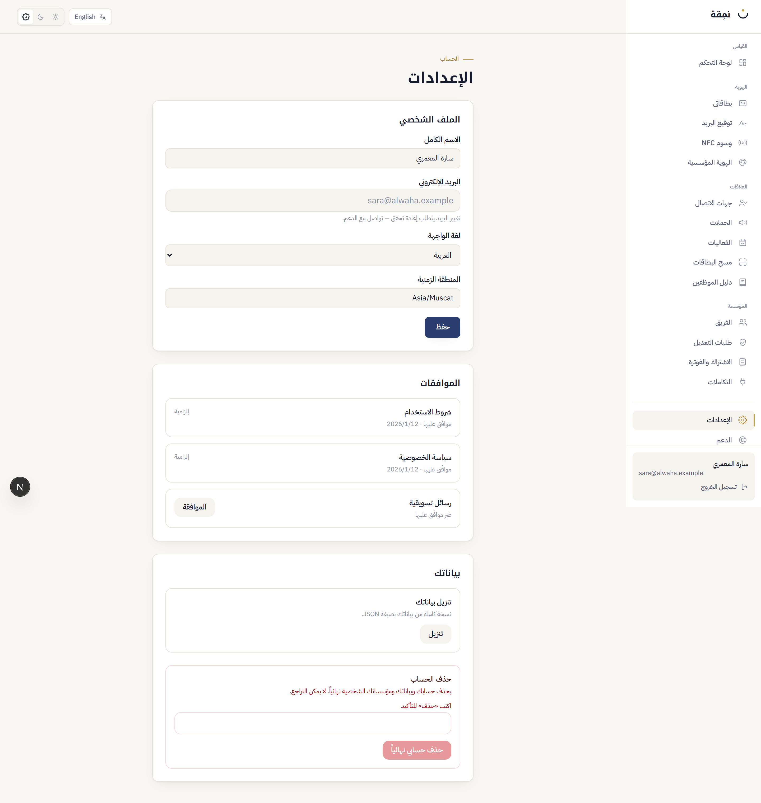

_الملف والموافقات ومنطقة الخطر._

### 22. الدعم

تذكرة واحدة لكل موضوع، وسجل كامل للمراسلة.

1. افتح تذكرة بموضوعها وتصنيفها وأولويتها.
2. تابع ردود فريق الدعم داخل التذكرة نفسها.
3. أضف ردّاً حين يُطلب منك توضيح.

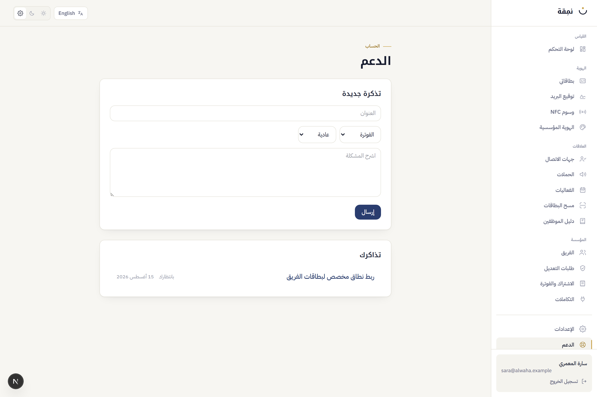

_قائمة التذاكر وحالاتها._

### 23. اللغة والمظهر

المنصّة كاملة بالعربية والإنجليزية، وبوضع فاتح وداكن، والاختيار يخصّ جهازك.

1. مبدّل اللغة في أعلى كل شاشة ينقلك إلى الصفحة نفسها باللغة الأخرى — لا إلى البداية.
2. مبدّل المظهر ثلاثة أوضاع: فاتح، داكن، وحسب النظام.
3. اختيارك يُحفَظ في متصفحك ويُطبَّق قبل أول رسم، فلا وميض عند فتح الصفحة.

> **ملاحظة** — لغة الواجهة لا علاقة لها بلغة بطاقتك المنشورة. الأولى تخصّك أنت، والثانية تخصّ من يفتح بطاقتك.

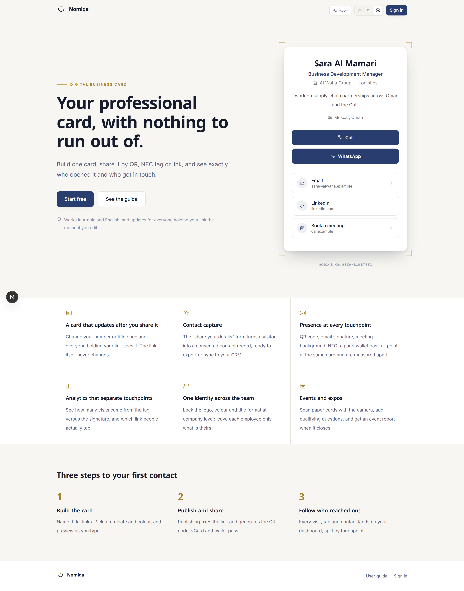

_الواجهة نفسها بالإنجليزية — التخطيط ينعكس بالكامل._

